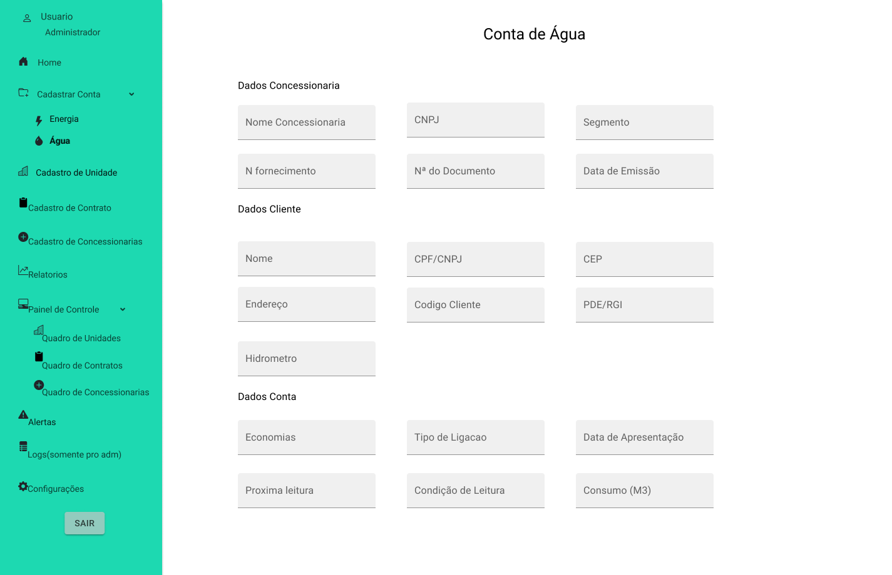

# Portifólio das APIs - Julio Cesar

<p align="justify">Portfólio das API (Aprendizagem por Projetos Integrados), elaborados do primeiro semestre até o sexto semestre do curso de banco de dados da Faculdade de Tecnologia Fatec. </p>

## Sumário

- [Sobre Mim](#sobre-mim)

- [Meus projetos](#meus-projetos)

  - [1º Semestre 1/2021 - ONG Vó Maria Félix](#1º-semestre---ong-vó-maria-félix)

  - [2º Semestre 2/2021 - Jetsoft](#2º-semestre---jetsoft)

  - [3º Semestre 1/2022 - Tecsus](#3º-semestre---tecsus)

  - [4º Semestre 2/2023 - Jaia](#4º-semestre---jaia)

- <a href="#sem5">5º Semestre 1/2024 - Tecsus</a>

- <a href="#sem6">6º Semestre 2/2024 - </a>

## Sobre Mim

<p align="center" >

E aí, pessoal! Sou desenvolvedor full stack e estou sempre buscando evoluir como desenvolvedor. Adoro café, música e viagens de moto, e é essa mistura que me inspira a buscar desafios cada vez mais estimulantes.

Minha paixão por tecnologia começou durante a graduação em Engenharia Aeronáutica, onde tive meu primeiro contato com programação em C. Esse primeiro passo foi fundamental para despertar meu interesse em lógica de programação e resolução de problemas. Em 2022, decidi me aprofundar ainda mais e iniciei o tecnólogo em Banco de Dados pela Fatec. Durante esse período, fui selecionado para um curso intensivo oferecido pelo iFood em desenvolvimento full stack, que me proporcionou um aprendizado prático e robusto em desenvolvimento web, api rest, banco de dados e versionamentos de codigo. Saí desse programa preparado para enfrentar qualquer desafio em projetos full stack, sempre com ênfase em lógica de programação, orientação a objetos e boas práticas de código.

A Fatec também tem sido um ambiente de aprendizado desafiador e prático. Por meio do método API (Aprendizagem por Projetos Integrados), desenvolvemos projetos complexos com especificações reais de empresas parceiras. Todo semestre, os projetos abrangem o ciclo completo de desenvolvimento: back-end, front-end e banco de dados, com um forte foco em lógica de programação e arquitetura de sistemas.

</p>

## Meus projetos

### 1/2021 | [Repositório](https://github.com/juliocesar1316/Projeto-Site-Intitucional)

### 1º Semestre - ONG Vó Maria Félix

Parceiro Acadêmico: [Faculdade de Tecnologia de São José dos Campos](https://fatecsjc-prd.azurewebsites.net/)

A proposta do projeto foi a elaboração de um website institucional visando a melhoria da visibilidade do centro de convivência infantil vó Maria Felix para o público de modo geral, onde o usuário poderá facilmente ter o acesso à informação sobre a ONG como: sua criação, história, funcionamento e os projetos em andamento.

Os interessados em ajudar na causa poderão fazer inscrição para ser voluntariado, doações, projetos / parcerias e podem ajudar compartilhando a ONG através do site.

### Etapas de Desenvolvimento


[Protótipo do Projeto](https://marvelapp.com/prototype/144cf1c4/screen/77188628)

### Prévia da Solução

### Tecnologias Utilizadas

[Marvel:](https://marvelapp.com/) Desenvolvimento do protótipo do site.

[HTML:](https://developer.mozilla.org/pt-BR/docs/Web/HTML) Estruturar o conteúdo de páginas web.

[CSS:](https://developer.mozilla.org/pt-BR/docs/Web/CSS) Estilizar e personalizar esses conteúdos.

[MySQL:](https://www.mysql.com/) Gerenciamento de banco de dados relacional usado para armazenar e recuperar dados de forma eficiente.

[PHP:](https://www.php.net/") Desenvolver páginas web dinâmicas e interativas.
<br>

### Contribuições Pessoais

Nesse primeiro semestre, realizamos um projeto para uma ONG escolar, onde o objetivo era desenvolver um site para que os usuários interessados pudessem ver suas causas e suas atividades.
Como metodologia aplicada no projeto utilizamos o scrum, porem nesse primeiro semestre não tivemos um product owner então fique encarregado de desenvolver o protótipo do projeto, onde apesar de ser a primeira experiência em prototipação e criação de layout tive alguns problemas, mas no final consegui ter um bom resultado na sprint 0.

<details>
  <summary>Layouts do Site</summary>
  <br>

- Layout Menu


- Layout Home


- Layout Cadastro


</details>

<br>

Na primeira sprint de fato, após o protótipo do site, começamos a realizar os desenvolvimentos e como desenvolvedor realizei no primeiro momento a configuração do XAMPP para ser utilizado o PHP e o MYSQL local e após configurar o grupo pode realizar o desenvolvimento. Além dessa configuração, por ser meu primeiro contato com HTML e PHP acabei tendo um pouco de dificuldade no começo para entender, mas após ajuda consegui desenvolver a tela de doação onde é realizado o cadastro do doador e o dados para a doação, a tela de participantes onde é realizado o cadastro de participantes e ajudei na tela de voluntários também onde é realizado os voluntariados da ONG. Como todos os desenvolvedores eram iniciantes, todas as telas eram realizadas, o back end no PHP, o front end com HTML e CSS e o banco de dados com o MySQL.

<details>
  <summary> Tela de Doação, Participante e Voluntario</summary>
  <br>

- Tela Doação


- Tela Participante


- Tela Voluntarios


</details>

<br>

Na segunda sprint, realizei a montagem das telas de contato, onde é exibido o local da escola e um formulário para entrar em contato, a tela de projetos, onde são exibidos os projetos sociais e um formulário para solicitar um projeto, e uma tela sobre a escola. Esse sprint e na anterior fiquei responsável pelo desenvolvimento das telas enquanto os outros desenvolvedores realizaram o desenvolvimento do captcha, da tela para que o usuário admin edite os textos do site e a tela de login.

<details>
  <summary> Tela de Contato, Projeto e Sobre</summary>
  <br>

- Tela Contato


- Tela Projeto


- Tela Sobre


</details>

<br>

Na terceira sprint já com todas as telas prontas, decidimos realizar as funções dos administradores e o nosso site tem um método onde o administrador consegue atualizar e manter o controle do site apenas via uma tela admin onde ele consegue atualizar os textos e imagens do site e aprova e reprova usuários. Como desenvolvedor, realizei a estilização e a montagem da tela no administrador, um banco de dados do site para ser visível sem utilizar o MySQL.

<details>
  <summary> Tela banco de dados admin e telas editaveis</summary>
  <br>

- Tela Banco de Dados


- Tela Sobre Editavel


</details>

<br>

Na quarta e última sprint, fique encarregado de algumas correções de bugs.

No final, conseguimos entregar um bom projeto, foi um desafio bem grande por ser o primeiro contato de programação para o grupo, mas com ajuda de todos e dos professores podemos ter uma boa entrega.

Vídeo do site institucional.

[Video institucional](https://www.youtube.com/watch?v=9K1p-P8zGd8)

<br>

### Hard Skills

| Hard Skills  |                                                             Utilização                                                              | Nível de proficiência |
| :----------: | :---------------------------------------------------------------------------------------------------------------------------------: | :-------------------: |
|    Marvel    |                                Desenvolvi habilidades na montagem de um protótipo dinâmico de site.                                 |       Avançado        |
|  HTML e CSS  |                         Desenvolvi habilidades na montagem de uma estrutura e estilização de páginas web.                           |     Intermediário     |
|     PHP      |  Utilizado para montagem da interatividade e dinâmica do site, realizado em conjunto com a equipe, porém com atividades autônomas.  |     Intermediário     |
|    MYSQL     | Utilizado para gerenciamento e armazenamento dos dados do site, realizado em conjunto com a equipe, porém com atividades autônomas. |     Intermediário     |
| GIT e GITHUB |      Utilizado controle e versionamento do projeto, realizado em conjunto com a equipe, porém com utilização de facilitadores.      |        Basico         |

### Soft Skills

|    Soft Skills     |                                      Utilização                                       |
| :----------------: | :-----------------------------------------------------------------------------------: |
|    Comunicação     | Utilizado para viabilizar reuniões com o time e a comunicação de atividades em grupo. |
|    Criatividade    |                  Utilizado na hora de produzir o protótipo do site.                   |
|   Adaptabilidade   |   Utilizado no projeto e na produção, pois estávamos trabalhando no formato online.   |
| Pensamento crítico |  Capacidade de analisar informações de forma lógica e tomar decisões fundamentadas.   |

[Voltar ao inicio](#sumário)

<br>

### 2/2021 | [Repositório](https://github.com/juliocesar1316/JetSoft)

### 2º Semestre - JetSoft

Parceiro Acadêmico: [JetSoft](https://jetsoft.com.br/)

O projeto foi elaborado para produzir um website para uma empresa de softwares que terceiriza serviços, onde ela terá a funcionalidade de emitir relatórios mensais apresentando o quadro de presença de colaboradores em posto de trabalhos acordados em contrato que passarão por um nível de aprovação.

Devido ao problema de falta de colaboradores se a empresa tiver acima de 20% de postos de trabalho em abertos, o mesmo paga multa de 35% do valor total do contrato e para que isso seja evitado outra funcionalidade do projeto e o quadro de colaboradores que possuirá alocações fixas e flutuantes parra caso ocorram eventos (férias, falta não justificada, licença diversas, demissão, entre outros).

### Etapas de Desenvolvimento


[Protótipo do Projeto](https://www.figma.com/design/0UK8InkkU5tLYeUhO8H9q4/JetSoft?m=dev&node-id=0%3A1&t=Imaw2PiYsY9z34PL-1)

### Prévia da Solução

### Tecnologias Utilizadas

[Figma:](https://www.figma.com/) Desenvolvimento do protótipo do site.

[HTML](https://developer.mozilla.org/pt-BR/docs/Web/HTML) Para estruturar o conteúdo de páginas web.

[CSS:](https://developer.mozilla.org/pt-BR/docs/Web/CSS) Para estilizar e personalizar esses conteúdos.

[Javascript:](https://developer.mozilla.org/pt-BR/docs/Web/JavaScript) Para desenvolver a dinamicidade e a interatividade do app.

[MySQL:](https://www.mysql.com/) Para gerenciamento de banco de dados relacional usado para armazenar e recuperar dados de forma eficiente.

[Flask:](https://flask.palletsprojects.com/en/3.0.x/) Micro framework para Python usado para desenvolver aplicações web.

### Contribuições Pessoais

Nesse segundo semestre, realizamos um projeto de web para controle de funcionários que terceirizam seus negócios utilizando uma metodologia ágil Scrum. Optei nesse semestre por ser o Scrum Master do time e no primeiro momento como o product owner não tinha experiencia em prototipação e montagem de layout eu como scrum master alinhei com todos os integrantes para auxiliarem na montagem, já deixando montado como vai ser o menu do aplicativo e onde ficaria localizado as funções seguintes.

<details>
  <summary>Layout Base</summary>
  <br>

- Layout Base


</details>

<br>

Após esse protótipo estar pronto, foi realizada a organização das tasks para que cada integrante realize e, para um controle maior do projeto como scrum master, alinhei com o time para serem feitas dailys diárias após a faculdade para compartilharmos nossas tasks e o andamento. Foi bastante proveitosa essa ideia, pois o time conseguiu evoluir bastante, não deixando de entregar resultados e sempre que algum desenvolvedor tivesse dificuldade, eu e os outros da equipe tentamos ajudar.

Na primeira sprint, após o protótipo ser aceite e as regras e as tasks da equipe serem alinhadas, o projeto começou. No primeiro momento para que o time tivesse foco na montagem do aplicativo realizei a montagem da tela base também que será utilizado no projeto inteiro com um menu interativo e já com as margens corretas para as funções, além disso, para o projeto utilizamos o framework Flask do Python e enquanto o pessoal desenvolvia eu estava estudando para auxiliar os demais o que foi de bastante ajuda, pois o pessoal do back end não estava conseguindo desenvolver o API rest no Flask, então montei duas rotas, uma para o controle de presença e uma para o cadastro de colaboradores para ser utilizado como exemplo.

<details>
  <summary>Rotas Utilizando Flask</summary>

  <br>

```
# importando framework flask e bibliotecas para usar servicoes web
from flask import Flask, render_template, request, redirect, url_for, flash

# importando biblioteca para conectar com mysql
from flaskext.mysql import MySQL

mysql = MySQL()
# iniciando variavel app
app = Flask(__name__)
app.secret_key = "flash message"

# configurando conexão com banco de dados
app.config['MYSQL_DATABASE_USER'] = 'root'
app.config['MYSQL_DATABASE_PASSWORD'] = ''
app.config['MYSQL_DATABASE_DB'] = 'jetsoft'
app.config['MYSQL_DATABASE_HOST'] = 'localhost'

mysql.init_app(app)

# rota para a página inicial


@app.route('/')
def index():
    return render_template('/index.html')


@app.route('/controle_presenca', methods=['GET', 'POST'])
def controle():

    con = mysql.connect()
    cur = con.cursor()
    cur.execute("SELECT * FROM controle_presenca")
    data = cur.fetchall()

    if request.method == "POST":
        colaborador = request.form["colaborador"]
        dia = request.form["dia"]
        pouf = request.form["pouf"]
        cur.execute(
            "UPDATE `controle_presenca` SET `%s` = %s WHERE `colaborador` = %s", (
                dia, pouf, colaborador)
        )
        con.commit()
        return redirect(url_for('controle'))
    else:
        return render_template('/controle_presenca.html', controle=data)

# rota para a página de destino (cadastro de colaboradores)


@app.route('/cadastro_colaboradores', methods=['GET', 'POST'])
# função para tratamento dos dados
def cadastro():
    # código de conectividade com banco de dados
    con = mysql.connect()
    cur = con.cursor()
    if request.method == "POST":
        flash("Dados gravados com sucesso!")
        nome = request.form["nome"]
        cpf = request.form["cpf"]
        matricula = request.form["matricula"]
        funcao = request.form["funcao"]
        admissao = request.form["admissao"]
        email = request.form["email"]
        telefone = request.form["telefone"]
        tipo_cobertura = request.form["devweb"]
        cur.execute("INSERT INTO `colaboradores`(`nome_completo`,`cpf`,`matricula`,`funcao`,`data_admissao`,`email`,`telefone`,`tipo_cobertura`) VALUES(%s, %s, %s, %s, %s, %s, %s, %s)",
                    (nome, cpf, matricula, funcao, admissao,
                    email, telefone, tipo_cobertura)
                    )
        cur.execute(
            "INSERT INTO `controle_presenca` (`colaborador`,`funcao`,`tipo_cobertura`) VALUES (%s, %s, %s)", (
                nome, funcao, tipo_cobertura)
        )
        con.commit()
        return redirect(url_for('cadastro'))
    else:
        return render_template('/cadastro_colaboradores.html')


if __name__ == "__main__":
    app.run(debug=True)
```

</details>

<br>

<details>
  <summary>Menu interativo</summary>

  <br>

- Menu interativo


</details>

<br>

<details>
  <summary>Burndonw 1-Sprint</summary>

  <br>

- Burndonw


</details>

<br>

Na segunda sprint após as reuniões, pude perceber haver um desenvolvedor com problemas e como scrum master fui atrás dele para poder auxiliar, para ser resolvido pedi para que compartilhasse a tela para podermos programar juntos e foi nesse momento que percebi que ele não estava se dedicando ao projeto, pois não estava entendendo como desenvolver direito e estava meio perdido, então auxiliei ele na hora para deixar o ambiente do projeto para ser desenvolvido e consegui clarear bastante as coisas para ele seguir o caminho e com isso ele conseguiu entregar sua parte nesse sprint com exito.

Mesmo que exercendo um papel de scrum master para que o projeto saísse de forma correta eu sempre acabava revisando o código do grupo para corrigir alguns problemas de edentação, correção de alguns bugs telas que às vezes por falta de mão de obra acabava fincando por fazer, resumindo eu estava operando como um tech lead em alguns momentos, mas sempre ajudando e organizando o tempo e as task da equipe.

<details>
  <summary>Burndonw 2-Sprint</summary>

- Burndonw


</details>

<br>

Na terceira sprint como em todos eu acabo revisando o código e facilitando o caminho da equipe os desenvolvedores tiverem bastante problema com o CSS, pois tinham que deixar alinhado na tela para que não ficasse sobreposto ou embaixo do menu lateral e como scrum master e já sabendo um pouco mais sobre CSS eu decidi ajudar a estilizar algumas telas para ficar no espaço desejado para que a equipe finalize a maioria do projeto. Não tive muitos problemas nesse sprint, após alinhar com os desenvolvedores que estavam um pouco abaixo do esperado na segunda sprint, na terceira eles melhoraram bastante e pude focar mais nessa parte do CSS que realmente era um problema e no gerenciamento do tempo.

<details>
  <summary>Burndonw 3-Sprint</summary>

- Burndonw


</details>

<br>

Na quarta e ultima sprint após o projeto ter finalizado, como um requisito funcional era para realizar o deploy da aplicação, porem o grupo não estava conseguindo realizar o deploy no Heroku então para que o problema fosse resolvido procurei várias formas de fazer o deploy de uma aplicação Python até que consegui achar a plataforma 'pythonanywhere' e enquanto o pessoal arrumava os bugs e realizava a confecção do botão de PDF eu estava testando e tentando implementar esse deploy. Após muito custo, consegui subir a aplicação na plataforma e entregar o projeto.

Foi uma experiência muito gratificante e bastante desafiadora, pois o grupo era novo e havia bastante impedimento tanto com questão de experiência em programação quanto com procrastinação de tasks. Mas no final consegui alinhar a equipe e entregamos um produto satisfatório para o cliente.

<details>
  <summary>Burndonw 4-Sprint</summary>

- Burndonw


</details>

<br>

<details>
  <summary>Projeto Finalizado</summary>
  <br>

[Video Projeto](https://www.youtube.com/watch?v=xGE51h8fBuY)

</details>

<br>

### Hard Skills

| Hard Skills  |                                                        Utilização                                                         | Nível de proficiência |
| :----------: | :-----------------------------------------------------------------------------------------------------------------------: | :-------------------: |
|    Figma     |                          Desenvolvi conhecimento na montagem de protótipos e layouts para site.                           |     Intermediário     |
|  HTML e CSS  |                    Desenvolvi habilidades na montagem de uma estrutura e estilização de páginas web.                      |     Intermediário     |
|  Javascript  |           Desenvolvi habilidades de criar scripts para deixar o site mais interativo e dinâmico para o usuário.           |     Intermediário     |
|    MYSQL     | Desenvolvi habilidades e conhecimentos no gerenciamento de databases e tabelas, além de montagem de querys para consulta. |     Intermediário     |
|    Flask     |           Desenvolvi habilidades em criar API rest e a conexão do front end com o back end no mesmo framework.            |     Intermediário     |
| GIT e GITHUB |                          Aprendi a utilizar os comandos do Git e seu funcionamento no GitHub.                             |     Intermediário     |

### Soft Skills

|          Soft Skills          |                                                       Utilização                                                        |
| :---------------------------: | :---------------------------------------------------------------------------------------------------------------------: |
|          Comunicação          |                  Utilizado para viabilizar reuniões com o time e a comunicação de atividades em grupo.                  |
|         Criatividade          |                                   Utilizado na hora de produzir o protótipo do site.                                    |
|        Adaptabilidade         |                   Utilizado no projeto e na produção, pois estávamos trabalhando no formato online.                     |
|      Pensamento crítico       |                  Capacidade de analisar informações de forma lógica e tomar decisões fundamentadas.                     |
|    Resolução de Conflitos     | Habilidade para mediar conflitos dentro da equipe de maneira construtiva e promover um ambiente de trabalho harmonioso. |
| Organização e Gestão do Tempo | Competência para manter a equipe organizada e garantir que as tarefas sejam concluídas dentro dos prazos estabelecidos. |

[Voltar ao inicio](#sumário)

<br>

### 1/2022 | [Repositório](https://github.com/juliocesar1316/TecSus)

### 3º Semestre - Tecsus

Parceiro Acadêmico: [Tecsus](https://tecsus.com.br/)

O projeto foi elaborado para produzir um software de gerenciamento de contas para uma startup que busca, por meio da tecnologia, tornar o planeta mais sustentável.

O sistema será desenvolvido para que o processo de cadastramento de contas, unidade, concessionarias e contratos possa ser simples e intuitivo, além de proporcionar ao usuário uma experiência mais dinâmica ao exibir as informações relevantes por meio de relatórios e gráficos descomplicados para análise

### Etapas de Desenvolvimento


### Prévia da Solução

### Tecnologias Utilizadas

[Figma:](https://www.figma.com/) Desenvolvimento do protótipo do site.

[HTML](https://developer.mozilla.org/pt-BR/docs/Web/HTML) Para estruturar o conteúdo de páginas web.

[CSS:](https://developer.mozilla.org/pt-BR/docs/Web/CSS) Para estilizar e personalizar esses conteúdos.

[React:](https://pt-br.legacy.reactjs.org/) Framework do JavaScript utilizado na construção de interfaces de usuário interativas e dinâmicas em aplicações web.

[Spring Boot:](https://spring.io/projects/spring-boot) Framework Java que simplifica o desenvolvimento de aplicativos robustos e escaláveis, oferecendo configuração mínima e alto desempenho.

[MySQL:](https://www.mysql.com/) Para gerenciamento de banco de dados relacional usado para armazenar e recuperar dados de forma eficiente.

### Contribuições Pessoais

Neste projeto, eu estava atuando como Product Owner, onde era responsável pelo contato com o cliente, definição de User Story, priorização do backlog e para este projeto eu realizei o design do mockup do aplicativo.

Após o contato com o cliente, foi possível a definição do User Story e do mockup onde foi utilizada a ferramenta Figma.

<details>
<summary>User Story</summary>

<br>

| User Story ID |                                       Como um (ator)                                       |                                                               Eu quero (ação)                                                               |                                                                          Para que seja possível (funcionalidade)                                                                          | Prioridade |
| :-----------: | :----------------------------------------------------------------------------------------: | :-----------------------------------------------------------------------------------------------------------------------------------------: | :---------------------------------------------------------------------------------------------------------------------------------------------------------------------------------------: | :--------: |
|       1       |                                         Digitador                                          |                    Guardar no sistema os dados das contas de água para análises, relatórios e ter um controle de sistema                    |                                                             Criar um cadastro de conta de água de maneira funcional e prático                                                             |     1      |
|       2       |                                         Digitador                                          |                  Guardar no sistema os dados das contas de energia para análises, relatórios e ter um controle de sistema                   |                                                           Criar um cadastro de conta de energia de maneira funcional e prático                                                            |     2      |
|       3       |                                         Digitador                                          |                  Guardar no sistema dados de unidades e ou empresas para análises, relatórios e ter um controle de sistema                  |                                                               Criar um cadastro de unidades de maneira funcional e prático                                                                |     3      |
|       4       |                                         Digitador                                          | Guardar no sistema dados de concessionaria que faz o fornecimento para tais unidades para análises, relatórios e ter um controle de sistema |                                                            Criar um cadastro de concessionarias de maneira funcional e prático                                                            |     4      |
|       5       |                                         Digitador                                          |           Cadastrar os contratos acordado com os clientes e unidade com sua respectiva concessionaria do segmento de água/esgoto            |                                                                 Criar um cadastro de contrato para contas de água/esgoto                                                                  |     5      |
|       6       |                                         Digitador                                          |             Cadastrar os contratos acordado com os clientes e unidade com sua respectiva concessionaria do segmento de energia              |                                                                   Criar um cadastro de contrato para contas de energia                                                                    |     6      |
|       7       |                                       Administrador                                        |                Os dados de unidade, concessionaria e contratos devem ser interligados para melhor controle e busca de dados                 |                               Criar bancos de dados relacional ligando uma unidade para um ou varios contratos e os contratos ligados a uma concessionaria                                |     8      |
|       8       |                                           Gestor                                           |               Fazer analises tecnicas/financeiras, comparar, fazer medias e ter um controle mensal e anual das contas de agua               |      Criar uma area com relatorios e graficos dessa contas de agua com metodos de filtragem e onde vai poder visualizar as contas de agua cadastradas, multas e desperdicio de agua       |     9      |
|       9       |                                           Gestor                                           |             Fazer analises tecnicas/financeiras, comparar, fazer medias e ter um controle mensal e anual das contas de energia              | Criar uma area com relatorios e graficos dessa contas de energia com metodos de filtragem e onde vai poder visualizar as contas de energia cadastradas , multas e desperdicio de energia  |     10     |
|      10       |                                           Gestor                                           |                               Ao entrar poder ver alguns graficos e dados do sistema para controles iniciais                                |                                          Criar uma area de dashboard onde vai ser a primeira pagina do sistema com graficos e dados informativos                                          |     11     |
|      11       |                                           Gestor                                           |                                          Um metodo que avise os alertas de consumo acima da media                                           |                                                 Criar uma area onde vai ter exibir os alertas de consumo acima da media e outros alertas                                                  |     12     |
|      12       |                                           Gestor                                           |                                 Um metodo que de para visualizar os dados com os parametros setados por mim                                 |                               Na aba de relatorios vai ser criado alguns campos para que seja adicionados os parametros e filtrar todos os dados dessa area                               |     13     |
|      13       |                                           Gestor                                           |                              Visualizar todas as unidades cadastradas e poder editar e excluir se for preciso                               |                              Criar uma aba de controle de dados onde vai ter uma tabela com todas as unidades cadastradas com icones para excluir e editrar                               |     14     |
|      14       |                                           Gestor                                           |                              Visualizar todas as unidades cadastradas e poder editar e excluir se for preciso                               |                           Criar uma aba de controle de dados onde vai ter uma tabela com todas as concessionarias cadastradas com icones para excluir e editrar                           |     15     |
|      15       |                                           Gestor                                           |                              Visualizar todos os contratos cadastrados e poder editar e excluir se for preciso                              |                              Criar uma aba de controle de dados onde vai ter uma tabela com todos os contratos cadastradas com icones para excluir e editrar                              |     16     |
|      16       | Digitador Atalhos para que a digitação das contas e os cadstros sejam mais rapidos e facil |              Criar atalhos como buscar cpf onde retorna os dados sobre aquele cpf digitado, metodo de tabs e setas do teclado               |                                                                                            17                                                                                             |
|      17       |                                           Gestor                                           |                                   Um modo de saber que os cadastros foram feitos, editados e ou excluidos                                   |                                            Criar um metodo de registro de logs onde a cada cadastro, edicao ou exclusao ele registrara no log                                             |     18     |
|      18       |                                          Cliente                                           |                                  Ter uma segurança de acesso ao sistema para que não fique aberto a todos                                   |                                                            Criar uma tela de login para que a pessoa entre com usario e senha                                                             |     19     |
|      19       |                                          Cliente                                           |                                     Niveis de acesso no sistema para administrador, gestor e digitador                                      |                                              Criar um cadastro master(administrador) para que possa criar os subniveis de acesso ao sistema                                               |     20     |
|      20       |                                         Digitador                                          |                                           Armazenar o arquivo da conta que acabou de ser digitada                                           |                                          Criar um metodo que possa fazer o upload do pdf, imagem, etc da conta para armazenar no banco de dados                                           |     21     |
|      21       |                                           Gestor                                           |                          Imprimir e ou guardar em meu computador os relatorios gerados pelo sistema em formato pdf                          |                                                     Criar um metodo que imprima na tela os relatorios que foram gerados para dowload                                                      |     22     |
|      23       |                             Gestor, Digitador e Adminnistrador                             |                        Um sistema com bastante atalhos, que fique bem usual para os usuarios e de facil entendimento                        | O sistema deve ser montado com menu lateral esquerdo com as abas de acesso totalmente limpo e de facil acesso e para areas externas do menu vao ser utilizados mais ou menos 100% da tela |     23     |

</details>

<br>

<details>
  <summary>Mockup do projeto</summary>

  <br>
  
  - Formulario concessionaria


- Formulario Unidade


- Contrato Agua


- Contrato Energia


- Conta Agua




- Conta Energia


- Quadro Concessionaria


- Modal Quadro Concessionaria


- Modal Quadro Concessionaria Update


- Quadro Unidade


- Modal Quadro Unidade


- Modal Quadro Unidade Update


- Quadro Contrato Agua


- Modal Quadro Contrato Agua


- Modal Quadro Contrato Agua Update


- Quadro Contrato Energia


- Modal Quadro Contrato Energia


- Modal Quadro Contrato Energia Update


- Tela Login


- Alertas de Consumo


- Relatório de Contas Agua


- Gráfico Consumo Mês Agua


- Gráfico Valor Total Mês Agua


- Relatório de Contas Energia


- Gráfico Consumo Mês Energia


- Gráfico Valor Total Mês Energia


</details>

<br>

Após o cliente aprovar o mockup e a priorização de backlog, podemos começar a organizar os grupos de back-end e front-end. Para este projeto foram utilizadas as linguagens React para front-end, Spring Boot para back-end e para o banco de dados foi utilizado o MySQL. As linguagens foram utilizadas por serem requisitos e pela preferência do grupo.

Apesar de estar operando como Product Owner, possuo algumas experiências com React e como meu grupo não tinha pessoas para o front eu decidi conciliar o PO com o desenvolvimento do front-end.

De começo, para auxiliar na programação das telas, foi utilizada a biblioteca Material Ui onde foram utilizados campos de input, botões e estilos. Como o React trabalha com componentes, no nosso projeto não foi diferente, para cada parte das páginas foi criado um componente para facilitar na programação e userStates para ser feito o controle do estado das variáveis.

<details>
  <summary>Modal de editar a concessionaria</summary>
  ```

    export default function EditConcessionaria({ dados, modalEdit }) {

    const classes = useStyles();
    const [cnpj, setCnpj] = useState(dados.cnpj);
    const [nome, setNome] = useState(dados.nome);
    const [segmento, setSegmento] = useState(dados.segmento);
    const [cep, setCep] = useState(dados.cep);
    const [rua, setRua] = useState(dados.rua);
    const [bairro, setBairro] = useState(dados.bairro);
    const [estado, setEstado] = useState(dados.uf);
    const [cidade, setCidade] = useState(dados.cidade);
    const [num_resid, setNum_resid] = useState(dados.numero);
    const [telefone, setTelefone] = useState(dados.telefone);
    const [inscricao_est, setInscricao_est] = useState(dados.inscricao_estadual);
    const [inscricao_unic, setInscricao_unic] = useState(
      dados.inscricao_especial
    );

    async function handleUpdate() {
      const data = {
        id: dados.id,
        cnpj: cnpj,
        nome: nome,
        segmento: segmento,
        cep: cep,
        rua: rua,
        bairro: bairro,
        cidade: cidade,
        uf: estado,
        numero: num_resid,
        telefone: telefone,
        inscricao_estadual: inscricao_est,
        inscricao_especial: inscricao_unic,
      };
      await fetch(`${baseURL}/concessionaria/atualizar`, {
        method: "PUT",
        headers: {
          "Content-Type": "application/json",
        },
        body: JSON.stringify(data),
      });
    }

    return (
      <form className={classes.root} onSubmit={handleUpdate}>
        <div className={classes.campo}>
          <TextField
            className={classes.text}
            required
            id="outlined-required"
            label="CNPJ"
            variant="outlined"
            fullWidth
            onChange={(e) => setCnpj(e.target.value)}
            value={cnpj}
          />
    ...
    )
    ```

</details>

<br>

O componente criado acima é um Modal que retorna os dados que foram salvos e edita as informações. Usando o useState é possível guardar o dado salvo e editá-lo como segundo estado da variável. A função handleUpdate é executada após apertar o botão de enviar, onde ele pega todas as alterações e atualiza os dados. No returno desse componente tem os inputs e as label que serão mostradas nesse modal.

Esse é um exemplo de um componente de dados que retorna os dados da concessionária para editar e, assim como esse, outros foram montados como inserir, editar e excluir dados do aplicativo.

Para o último sprint, foi acordado com o cliente que era para inserir uma página de relatório com gráficos relacionados a contas de água e contas de energia inseridas.

Para o gráfico, optei por utilizar a biblioteca recharts para React onde ele consegue gerar um gráfico com os dados das contas.

<details>
  <summary>Componente de grafico da agua usado na pagina de relatorios</summary>
  ```

    import {
      AreaChart,
      XAxis,
      YAxis,
      CartesianGrid,
      Tooltip,
      Area,
    } from "recharts";
    import FormControl from "@material-ui/core/FormControl";
    import RadioGroup from "@material-ui/core/RadioGroup";
    import FormControlLabel from "@material-ui/core/FormControlLabel";
    import { useState } from "react";
    import Radio from "@material-ui/core/Radio";
    import "./style.css";

    function GraficoAgua({ listaRelatorioAguas }) {
      const [variavelY, setVariavelY] = useState();
      const [legenda, setLegenda] = useState();
      const [checked, setChecked] = useState("Valor Total R$");

      const handleChange = (event) => {
        setChecked(event.target.value);
      };

      const dataConsumo = listaRelatorioAguas.map((x) => {
        const arrayData = x.data_emissao.split("-");
        const ano = `${arrayData[0]}`;
        const mes = `${arrayData[1]}`;
        return {
          name: `${mes}/${ano}`,
          uv: x.consumo_m3,
        };
      });

      const daTaValorTotal = listaRelatorioAguas.map((x) => {
        const arrayData = x.data_emissao.split("-");
        const ano = `${arrayData[0]}`;
        const mes = `${arrayData[1]}`;
        return {
          name: `${mes}/${ano}`,
          uv: x.valor_total,
        };
      });

      return (
        <div className="main-dados">
          <div className="Agua">
            <AreaChart
              width={900}
              height={450}
              data={variavelY ? variavelY : daTaValorTotal}
              margin={{ top: 30, right: 20, left: 0, bottom: 0 }}
            >
              <defs>
                <linearGradient id="colorUv" x1="0" y1="0" x2="0" y2="2">
                  <stop offset="5%" stopColor="#5664D2" stopOpacity={0.8} />
                  <stop offset="95%" stopColor="#5664D2" stopOpacity={0} />
                </linearGradient>
              </defs>
              <XAxis dataKey="name" />
              <YAxis />
              <CartesianGrid strokeDasharray="3 3" />
              <Tooltip />
              <Area
                type="monotone"
                name={legenda ? legenda : "Valor Total (R$)"}
                dataKey="uv"
                stroke="#5664D2"
                fillOpacity={1}
                fill="url(#colorUv)"
              />
            </AreaChart>
          </div>
          <div className="buttons">
            <FormControl component="fieldset">
              <RadioGroup row value={checked} onChange={handleChange}>
                <FormControlLabel
                  value="Valor Total R$"
                  control={<Radio />}
                  label="Valor Total R$"
                  onClick={() => {
                    setVariavelY(daTaValorTotal);
                    setLegenda("Valor Total (R$)");
                  }}
                />
                <FormControlLabel
                  value="Consumo Mês (M³)"
                  control={<Radio />}
                  label="Consumo Mês (M³)"
                  onClick={() => {
                    setVariavelY(dataConsumo);
                    setLegenda("Consumo Mês (M³)");
                  }}
                />
              </RadioGroup>
            </FormControl>
          </div>
        </div>
      );
    }

    export default GraficoAgua;
    ```

</details>

<br>

O código acima monta o gráfico através dos dados recebidos no JSON do back-end e filtra conforme os valores total mensal e consumo mensal.

<details>
  <summary>Gif do grafico e filtros</summary>
  
  <br>


</details>

<br>

E com isso é finalizado a API, colocamos o back-end no Heroku para facilitar na requisição de dados do front-end e conseguimos entregar um bom projeto. O cliente ficou satisfeito com o resultado.

Porém, nesta API eu estava como product owner, porém dois integrantes que ficaram na parte do front não acabaram ajudando muito, então acabei que fiquei mais empenhado como desenvolvedor, mas nunca deixando minhas tarefas como product owner de lado.

### Hard Skills

| Hard Skills  |                                                         Utilização                                                         | Nível de proficiência |
| :----------: | :------------------------------------------------------------------------------------------------------------------------: | :-------------------: |
|    Figma     |                           Desenvolvi conhecimento na montagem de protótipos e layouts para site.                           |     Intermediário     |
|  HTML e CSS  |                    Desenvolvi habilidades na montagem de uma estrutura e estilização de páginas web.                       |     Intermediário     |
|  Javascript  |           Desenvolvi habilidades de criar scripts para deixar o site mais interativo e dinâmico para o usuário.            |     Intermediário     |
|    MYSQL     | Desenvolvi habilidades e conhecimentos no gerenciamento de databases e tabelas, além de modelagem de querys para consulta. |     Intermediário     |
|    Flask     |            Desenvolvi habilidades em criar API rest e a conexão do front end com o back end no mesmo framework.            |     Intermediário     |
| GIT e GITHUB |                           Aprendi a utilizar os comandos do Git e seu funcionamento no GitHub.                             |     Intermediário     |

### Soft Skills

|          Soft Skills          |                                                       Utilização                                                        |
| :---------------------------: | :---------------------------------------------------------------------------------------------------------------------: |
|          Comunicação          |                  Utilizado para viabilizar reuniões com o time e a comunicação de atividades em grupo.                  |
|         Criatividade          |                                  Utilizado na hora de produzir o protótipo do site.                                     |
|        Adaptabilidade         |                   Utilizado no projeto e na produção, pois estávamos trabalhando no formato online.                     |
|      Pensamento crítico       |                   Capacidade de analisar informações de forma lógica e tomar decisões fundamentadas.                    |
|    Resolução de Conflitos     | Habilidade para mediar conflitos dentro da equipe de maneira construtiva e promover um ambiente de trabalho harmonioso. |
| Organização e Gestão do Tempo | Competência para manter a equipe organizada e garantir que as tarefas sejam concluídas dentro dos prazos estabelecidos. |

[Voltar ao inicio](#sumário)

<br>

### 2/2023 | [Repositório](https://github.com/B1nary-Devs/JAIA-SOFTWARE)

### 4º Semestre - Jaia

Parceiro Acadêmico: [Jaia](https://www.jaia.software/)

O desafio consiste em desenvolver um sistema abrangente para controlar anomalias identificadas em um Laudo de Inspeção Predial, com funcionalidades-chave como diferenciação de segmentos específicos de um edifício, cadastro de prestadores de serviço, geração eficiente de ordens de serviço e criação de relatórios detalhados. Esse sistema é crucial para melhorar a gestão e a eficácia na correção de anomalias, promovendo a preservação do patrimônio e tomada de decisões informadas.

A equipe da B1nary Devs desenvolverá um sistema web abrangente que simplificará a gestão de prestadores de serviço, segmentos e ordens de serviço. Como parte deste projeto, estamos desenvolvendo uma landing page intuitiva que facilitará a solicitação de novas ordens de serviço para os nossos novos clientes por meio de um simples formulário. Para os nossos clientes existentes, disponibilizaremos uma landing page personalizada, onde poderão acessar facilmente suas ordens de serviço anteriores, baixar laudos novamente e dar feedbacks valiosos, incluindo sugestões e reclamações. Além disso, eles também terão a opção de fazer novas solicitações de ordens de serviço.

### Etapas de Desenvolvimento


### Prévia da Solução

### Tecnologias Utilizadas

[Figma:](https://www.figma.com/) Desenvolvimento do protótipo do site.

[HTML](https://developer.mozilla.org/pt-BR/docs/Web/HTML) Para estruturar o conteúdo de páginas web.

[CSS:](https://developer.mozilla.org/pt-BR/docs/Web/CSS) Para estilizar e personalizar esses conteúdos.

[Vue:](https://vuejs.org/) Framework do JavaScript utilizado na construção de interfaces de usuário interativas e dinâmicas em aplicações web.

[Spring Boot:](https://spring.io/projects/spring-boot) Framework Java que simplifica o desenvolvimento de aplicativos robustos e escaláveis, oferecendo configuração mínima e alto desempenho.

[Oracle:](https://www.oracle.com/br/) Para gerenciamento de banco de dados relacional usado para armazenar e recuperar dados de forma eficiente.

### Contribuições Pessoais

Esse projeto foi a minha primeira API realizada no curso de Banco de Dados na turma noturna. Por ser um grupo novo, tive que me adaptar ao estilo de trabalho deles.

O projeto se trata de um desenvolvimento web para controle de anomalias identificadas em um Laudo de Inspeção Predial, onde o usuário pode gerenciar os prestadores de serviço, as ordens de serviço e o laudo da inspeção. O grupo foi dividido em front e back e como no grupo já havia um desenvolvedor front-end onde foi utilizado o Vue.js como framework, porém optei por realizar o back-end, pois teria mais demandas e seria um novo desafio para mim, que não tinha muita familiaridade com Spring Boot.

No sprint zero foi desenvolvido o planejamento do projeto e a modelagem do banco de dados e como se tratava de ordem de serviço e prestador para várias ordens de serviço foi utilizado bastante o relacionamento de um para muitos e muitos para muitos tanto para o banco de dados quanto para o back end em spring boot, para mim, seria um dos primeiros contatos com modelagem em banco com esse relacionamento e trabalho com back end tratando os dados com relacionamentos.

Na primeira sprint, foi utilizado padrão de arquitetura MVC (module view control) no Spring Boot, que é basicamente o Model (Modelo) que representa a lógica de negócios e os dados da aplicação. Inclui as classes que definem os dados e as regras de negócio. A View (Visão) sendo responsável pela apresentação dos dados e o Controller (Controlador) que atua como intermediário entre o Model e a View. Processa as requisições dos usuários, manipula os dados usando o Model e retorna a resposta adequada através da View. Nesse sprint eu fiquei encarregado de montar o MVC do prestador de serviço comecei pelas classes e entidades do prestador, porem o que tive mais dificuldades foi na hora de montar o serviço, que era onde ficavam nossas funções que retornar os dados do banco de dados, minha dificuldade foi na hora de retornar os dados, pois o método é montado por meio de ação como "findByEmail" para retornar os emails, só que algumas vezes não retornavam o que eu queria, porem após algumas ajudas e vídeos aulas consegui entender e terminar essa parte.

<details>
<summary> Service Prestador </summary>

```
package br.com.jaia.b1naryinspec.service;

import java.util.List;
import java.util.Optional;

import org.springframework.beans.factory.annotation.Autowired;
import org.springframework.stereotype.Service;

import br.com.jaia.b1naryinspec.dto.PrestadorDto;
import br.com.jaia.b1naryinspec.model.PrestadorServico;
import br.com.jaia.b1naryinspec.repository.PrestadorRepository;

@Service
public class PrestadorService implements PrestadorInterface {

    @Autowired
    private PrestadorRepository prestadorRepo;

    @Override
    public PrestadorServico novoPrestador(PrestadorDto prestadorDto) {
        if(prestadorDto == null ||
            prestadorDto.getEmail() == null ||
            prestadorDto.getEmail().isBlank() ||
            prestadorDto.getSenha() == null ||
            prestadorDto.getSenha().isBlank()){
                throw new IllegalArgumentException("Dados Invalidos");
        }
        PrestadorServico prestador = new PrestadorServico();
        prestador.setCnpj(prestadorDto.getCnpj());
        prestador.setEmail(prestadorDto.getEmail());
        prestador.setSenha(prestadorDto.getSenha());
        prestador.setPrestadorNome(prestadorDto.getPrestadorNome());
        prestador.setPrestadorId(prestadorDto.getPrestadorId());
        return prestadorRepo.save(prestador);
    }

    @Override
    public List<PrestadorServico> buscarTodosPrestadores() {
        return prestadorRepo.findAll();
    }

    @Override
    public PrestadorServico buscarPrestadoPorCnpj(String cnpj) {
        Optional<PrestadorServico> prestadorOp = prestadorRepo.findByCnpj(cnpj);
        if(prestadorOp.isEmpty()){
            throw new IllegalArgumentException("Prestador de serviço não encontrado!");
        }

        return prestadorOp.get();
    }

    @Override
    public PrestadorServico buscarPrestadorPorEmail(String email) {
        Optional<PrestadorServico> prestadorOp = prestadorRepo.findByEmail(email);
        if(prestadorOp.isEmpty()){
            throw new IllegalArgumentException("Prestador de serviço não encontrado!");
        }
        return prestadorOp.get();
    }

    @Override
    public PrestadorServico buscarPrestadorPorNome(String prestadorNome){
        Optional<PrestadorServico> prestadorOp = prestadorRepo.findByPrestadorNome(prestadorNome);
        if(prestadorOp.isEmpty()){
             throw new IllegalArgumentException("Prestador de serviço não encontrado!");
        }
        return prestadorOp.get();
    }

    @Override
    public PrestadorServico updatePrestador(Long prestadorId, PrestadorDto prestadorDto){

        Optional<PrestadorServico> prestadorOp = prestadorRepo.findById(prestadorId);
        if(prestadorOp.isEmpty()){
             throw new IllegalArgumentException("Prestador de serviço não encontrado!");
        }
        PrestadorServico prestador = prestadorOp.get();
        prestador.setCnpj(prestadorDto.getCnpj());
        prestador.setEmail(prestadorDto.getEmail());
        prestador.setSenha(prestadorDto.getSenha());
        prestador.setPrestadorNome(prestadorDto.getPrestadorNome());

        return prestadorRepo.save(prestador);
    }

    @Override
    public Optional<PrestadorServico> deletePrestador(Long prestadorId){
        Optional<PrestadorServico> prestadorOp = prestadorRepo.findById(prestadorId);
        if(prestadorOp.isPresent()){
            prestadorRepo.deleteById(prestadorId);
        }
        return prestadorOp;
    }

}
```

</details>

<br>

Após terminar o service eu finalizei o controler e minhas atividades, mas vi que um dos desenvolvedores do back end estava com dificuldades na hora de montar o relacionamento de um para muitos, pois estávamos aprendendo na aula ainda como utilizar esse método então para nos estava um pouco confuso e para ajudar peguei a task dele de montar o MVC do checkilist que é onde o prestador ou usuário valida as informações do laudo. Finalizada essa parte, quase no final do sprint, eles ainda estavam tentando solucionar esse caso dos relacionamentos, porém sem muito sucesso.

Na segunda sprint os esforços do time do back foi em entender esses relacionamentos de um para um, um para muitos e muitos para muitos e eu como desenvolvedor comecei a estudar sobre e fazer alguns desenvolvimentos e teste com o grupo onde podemos entender como funciona e colocar em prática no desenvolvimento do projeto. Também nesse sprint, após auxiliar os desenvolvedores, eu peguei a task de montar o MVC do cliente, onde não tive muitos problemas, pois já tinha feito um igual e já sabia mais ou menos os erros conhecidos e o que poderia dar.

Na primeira e segunda sprint eu fiquei na parte do back end, porem um dos integrantes do front end não estava entregando resultados e o grupo estava optando por mandá-lo embora e como eu já havia participado com scrum master e tinha resolvido bastantes problemas decidi mostrar meu ponto de vista, pois o integrante assim como eu queria um novo desafio, porem não conseguiu dar conta então para que o problema fosse resolvido eu troquei de lugar com ele, pois tinha muito mais facilidade no front e o integrante no back. Problema resolvido, seguimos para a terceira sprint.

Na terceira sprint inicialmente eu comecei a desenvolver o login tanto o layout do site quanto a parte de realizar o login na plataforma, como o back end já tinha desenvolvido a função de autenticação o que fiz foi ajustar uma rota para ele enviar os dados do login para o back autenticar e me retornar um token, onde eu armazenava no localstorage e coim isso a cada requisição realizada pelo front ele mandava esse token para ser validado pelo sistema, garantindo uma integridade de segurança dos dados.

Após essa tela de login, decidi realizar o desenvolvimento da tela do modal onde o usuário aprova as ordens de serviço, onde o usuário teria os checklists cadastrados para aquela atividade e poderia aprovar ou reprovar caso o não passe no Checklist. Em uma tela, estão as ordens de serviço e o usuário que aprova as ordens vai clicar nelas e nisso irá abrir um modal com os checklists para ser validado. Após validado, ele fecha esse modal.

<details>
<summary>Tela de aprovação de ordem de serviço e codigo do modal</summary>


```
  <template>
      <div class="modal-ordem-background">
          <div class="modal">
              <div class="modal-title">
                  <h1>Ordem N° {{ id }}</h1>
                  <!-- usando a função para trocar o estado do modal-->
                  <button class="modal-fechar" @click="toggleModal()">
                      <svg xmlns="http://www.w3.org/2000/svg" fill="currentColor" class="bi bi-x-lg" viewBox="0 0 16 16">
                          <path
                              d="M2.146 2.854a.5.5 0 1 1 .708-.708L8 7.293l5.146-5.147a.5.5 0 0 1 .708.708L8.707 8l5.147 5.146a.5.5 0 0 1-.708.708L8 8.707l-5.146 5.147a.5.5 0 0 1-.708-.708L7.293 8 2.146 2.854Z" />
                      </svg>
                  </button>
              </div>
              <div class="modal-cons-body">
                  <div class="modal-box-group">
                      <div class="modal-box">
                          <p>
                              <svg xmlns="http://www.w3.org/2000/svg" fill="currentColor" class="bi bi-calendar-check"
                                  viewBox="0 0 16 16">
                                  <path
                                      d="M10.854 7.146a.5.5 0 0 1 0 .708l-3 3a.5.5 0 0 1-.708 0l-1.5-1.5a.5.5 0 1 1 .708-.708L7.5 9.793l2.646-2.647a.5.5 0 0 1 .708 0z" />
                                  <path
                                      d="M3.5 0a.5.5 0 0 1 .5.5V1h8V.5a.5.5 0 0 1 1 0V1h1a2 2 0 0 1 2 2v11a2 2 0 0 1-2 2H2a2 2 0 0 1-2-2V3a2 2 0 0 1 2-2h1V.5a.5.5 0 0 1 .5-.5zM1 4v10a1 1 0 0 0 1 1h12a1 1 0 0 0 1-1V4H1z" />
                              </svg>
                              Data de Abertura:
                          </p>
                          <span>{{ dtaAbertura }}</span>
                      </div>
                  </div>
                  <div class="modal-box-group">
                      <div class="modal-box">
                          <p>
                              <svg xmlns="http://www.w3.org/2000/svg" fill="currentColor" class="bi bi-calendar-x"
                                  viewBox="0 0 16 16">
                                  <path
                                      d="M6.146 7.146a.5.5 0 0 1 .708 0L8 8.293l1.146-1.147a.5.5 0 1 1 .708.708L8.707 9l1.147 1.146a.5.5 0 0 1-.708.708L8 9.707l-1.146 1.147a.5.5 0 0 1-.708-.708L7.293 9 6.146 7.854a.5.5 0 0 1 0-.708z" />
                                  <path
                                      d="M3.5 0a.5.5 0 0 1 .5.5V1h8V.5a.5.5 0 0 1 1 0V1h1a2 2 0 0 1 2 2v11a2 2 0 0 1-2 2H2a2 2 0 0 1-2-2V3a2 2 0 0 1 2-2h1V.5a.5.5 0 0 1 .5-.5zM1 4v10a1 1 0 0 0 1 1h12a1 1 0 0 0 1-1V4H1z" />
                              </svg>
                              Data de Fechamento:
                          </p>
                          <span>{{ dtaFechamento }}</span>
                      </div>
                  </div>
                  <div class="modal-box-group">
                      <div class="modal-box">
                          <p>
                              <svg xmlns="http://www.w3.org/2000/svg" fill="currentColor" class="bi bi-person"
                                  viewBox="0 0 16 16">
                                  <path
                                      d="M8 8a3 3 0 1 0 0-6 3 3 0 0 0 0 6Zm2-3a2 2 0 1 1-4 0 2 2 0 0 1 4 0Zm4 8c0 1-1 1-1 1H3s-1 0-1-1 1-4 6-4 6 3 6 4Zm-1-.004c-.001-.246-.154-.986-.832-1.664C11.516 10.68 10.289 10 8 10c-2.29 0-3.516.68-4.168 1.332-.678.678-.83 1.418-.832 1.664h10Z" />
                              </svg>
                              Prestador:
                          </p>
                          <span>{{ prestador }}</span>
                      </div>
                  </div>
                  <div class="modal-box-group">
                      <div class="modal-box">
                          <p>
                              <svg xmlns="http://www.w3.org/2000/svg" fill="currentColor" class="bi bi-building"
                                  viewBox="0 0 16 16">
                                  <path
                                      d="M4 2.5a.5.5 0 0 1 .5-.5h1a.5.5 0 0 1 .5.5v1a.5.5 0 0 1-.5.5h-1a.5.5 0 0 1-.5-.5v-1Zm3 0a.5.5 0 0 1 .5-.5h1a.5.5 0 0 1 .5.5v1a.5.5 0 0 1-.5.5h-1a.5.5 0 0 1-.5-.5v-1Zm3.5-.5a.5.5 0 0 0-.5.5v1a.5.5 0 0 0 .5.5h1a.5.5 0 0 0 .5-.5v-1a.5.5 0 0 0-.5-.5h-1ZM4 5.5a.5.5 0 0 1 .5-.5h1a.5.5 0 0 1 .5.5v1a.5.5 0 0 1-.5.5h-1a.5.5 0 0 1-.5-.5v-1ZM7.5 5a.5.5 0 0 0-.5.5v1a.5.5 0 0 0 .5.5h1a.5.5 0 0 0 .5-.5v-1a.5.5 0 0 0-.5-.5h-1Zm2.5.5a.5.5 0 0 1 .5-.5h1a.5.5 0 0 1 .5.5v1a.5.5 0 0 1-.5.5h-1a.5.5 0 0 1-.5-.5v-1ZM4.5 8a.5.5 0 0 0-.5.5v1a.5.5 0 0 0 .5.5h1a.5.5 0 0 0 .5-.5v-1a.5.5 0 0 0-.5-.5h-1Zm2.5.5a.5.5 0 0 1 .5-.5h1a.5.5 0 0 1 .5.5v1a.5.5 0 0 1-.5.5h-1a.5.5 0 0 1-.5-.5v-1Zm3.5-.5a.5.5 0 0 0-.5.5v1a.5.5 0 0 0 .5.5h1a.5.5 0 0 0 .5-.5v-1a.5.5 0 0 0-.5-.5h-1Z" />
                                  <path
                                      d="M2 1a1 1 0 0 1 1-1h10a1 1 0 0 1 1 1v14a1 1 0 0 1-1 1H3a1 1 0 0 1-1-1V1Zm11 0H3v14h3v-2.5a.5.5 0 0 1 .5-.5h3a.5.5 0 0 1 .5.5V15h3V1Z" />
                              </svg>
                              Cliente:
                          </p>
                          <span>{{ cliente }}</span>
                      </div>
                  </div>
                  <div class="modal-box-group">
                      <div class="modal-box">
                          <p>
                              <svg xmlns="http://www.w3.org/2000/svg" fill="currentColor" class="bi bi-bookmark"
                                  viewBox="0 0 16 16">
                                  <path
                                      d="M2 2a2 2 0 0 1 2-2h8a2 2 0 0 1 2 2v13.5a.5.5 0 0 1-.777.416L8 13.101l-5.223 2.815A.5.5 0 0 1 2 15.5V2zm2-1a1 1 0 0 0-1 1v12.566l4.723-2.482a.5.5 0 0 1 .554 0L13 14.566V2a1 1 0 0 0-1-1H4z" />
                              </svg>
                              Status:
                          </p>
                          <span>{{ status }}</span>
                      </div>
                  </div>
                  <div class="modal-box-group">
                      <div class="modal-box">
                          <p>
                              <svg xmlns="http://www.w3.org/2000/svg" fill="currentColor"
                                  class="bi bi-wrench-adjustable-circle" viewBox="0 0 16 16">
                                  <path
                                      d="M12.496 8a4.491 4.491 0 0 1-1.703 3.526L9.497 8.5l2.959-1.11c.027.2.04.403.04.61Z" />
                                  <path
                                      d="M16 8A8 8 0 1 1 0 8a8 8 0 0 1 16 0Zm-1 0a7 7 0 1 0-13.202 3.249l1.988-1.657a4.5 4.5 0 0 1 7.537-4.623L7.497 6.5l1 2.5 1.333 3.11c-.56.251-1.18.39-1.833.39a4.49 4.49 0 0 1-1.592-.29L4.747 14.2A7 7 0 0 0 15 8Zm-8.295.139a.25.25 0 0 0-.288-.376l-1.5.5.159.474.808-.27-.595.894a.25.25 0 0 0 .287.376l.808-.27-.595.894a.25.25 0 0 0 .287.376l1.5-.5-.159-.474-.808.27.596-.894a.25.25 0 0 0-.288-.376l-.808.27.596-.894Z" />
                              </svg>
                              Segmento:
                          </p>
                          <span>{{ segmento }}</span>
                      </div>
                  </div>
                  <div class="modal-box-group">
                      <div class="modal-box">
                          <p>
                              <svg xmlns="http://www.w3.org/2000/svg"  fill="currentColor" class="bi bi-card-checklist" viewBox="0 0 16 16">
                                  <path
                                      d="M14.5 3a.5.5 0 0 1 .5.5v9a.5.5 0 0 1-.5.5h-13a.5.5 0 0 1-.5-.5v-9a.5.5 0 0 1 .5-.5h13zm-13-1A1.5 1.5 0 0 0 0 3.5v9A1.5 1.5 0 0 0 1.5 14h13a1.5 1.5 0 0 0 1.5-1.5v-9A1.5 1.5 0 0 0 14.5 2h-13z"/>
                                  <path
                                      d="M7 5.5a.5.5 0 0 1 .5-.5h5a.5.5 0 0 1 0 1h-5a.5.5 0 0 1-.5-.5zm-1.496-.854a.5.5 0 0 1 0 .708l-1.5 1.5a.5.5 0 0 1-.708 0l-.5-.5a.5.5 0 1 1 .708-.708l.146.147 1.146-1.147a.5.5 0 0 1 .708 0zM7 9.5a.5.5 0 0 1 .5-.5h5a.5.5 0 0 1 0 1h-5a.5.5 0 0 1-.5-.5zm-1.496-.854a.5.5 0 0 1 0 .708l-1.5 1.5a.5.5 0 0 1-.708 0l-.5-.5a.5.5 0 0 1 .708-.708l.146.147 1.146-1.147a.5.5 0 0 1 .708 0z"/>
                              </svg>
                              Checklist:
                          </p>
                          <span>{{ check }}</span>
                      </div>
                  </div>
                  <div class="modal-box-group">
                      <div class="modal-box-desc">
                          <h4>
                              <svg xmlns="http://www.w3.org/2000/svg" fill="currentColor" class="bi bi-textarea-t"
                                  viewBox="0 0 16 16">
                                  <path
                                      d="M1.5 2.5A1.5 1.5 0 0 1 3 1h10a1.5 1.5 0 0 1 1.5 1.5v3.563a2 2 0 0 1 0 3.874V13.5A1.5 1.5 0 0 1 13 15H3a1.5 1.5 0 0 1-1.5-1.5V9.937a2 2 0 0 1 0-3.874V2.5zm1 3.563a2 2 0 0 1 0 3.874V13.5a.5.5 0 0 0 .5.5h10a.5.5 0 0 0 .5-.5V9.937a2 2 0 0 1 0-3.874V2.5A.5.5 0 0 0 13 2H3a.5.5 0 0 0-.5.5v3.563zM2 7a1 1 0 1 0 0 2 1 1 0 0 0 0-2zm12 0a1 1 0 1 0 0 2 1 1 0 0 0 0-2z" />
                                  <path
                                      d="M11.434 4H4.566L4.5 5.994h.386c.21-1.252.612-1.446 2.173-1.495l.343-.011v6.343c0 .537-.116.665-1.049.748V12h3.294v-.421c-.938-.083-1.054-.21-1.054-.748V4.488l.348.01c1.56.05 1.963.244 2.173 1.496h.386L11.434 4z" />
                              </svg>
                              Descrição:
                          </h4>
                          <p id="text-desc">{{ desc }}</p>
                      </div>
                  </div>
              </div>
          </div>
      </div>
  </template>

  <script setup lang="ts">
  import '../assets/css/modal/modal.css'
  import { ref } from 'vue';
  //aqui importando a função para ser usada no modal
  const props = defineProps({
      toggleModal: {
          type: Function,
          required: true,
      },
      id: String,
      dtaAbertura: String,
      dtaFechamento: String,
      prestador: String,
      segmento: String,
      cliente: String,
      status: String,
      desc: String,
      check: []
  });
  //outra parte do import
  const { toggleModal } = props;
  </script>

```

</details>

<br>

Após realizar o login e o modal, fiz a correção e estilização de algumas telas para ficar mais parecido com o layout do protótipo e desenvolvi mais um de edição de dados da ordem, onde através da requisição rest ele retorna os dados e faz o update. Acabei trabalhando bastante nesse sprint, pois o desenvolvedor que estava com problemas havia atrasado algumas features então nesse sprint, para agilizar o projeto, acabei desenvolvendo elas.

Na quarta sprint como já havia adiantado bastante coisa na terceira e como eu já tinha desenvolvido as telas de modal eu resolvi corrigir alguns bugs dos modais das outras telas que não estavam retornando os dados corretamente, pois havia uma falta de dados para realizar as requisições rest que populavam esses modais. Realizei as correções, fiz algumas modificações nas telas de login para que toda e qualquer requisição que fizesse para o back ele solicitasse o token.

No final, deu tudo certo, conseguimos entregar um produto de qualidade para o cliente, que adorou o sistema. Houve bastantes conflitos internos como mencionei houve desavenças por falta de entrega de resultados, mas com comunicação e paciência foi possível desenvolver o que para mim também havia sido um grande desafio tanto pelo back end em spring boot que apesar das dificuldades consegui entregar o que havia planejado, quanto para o front, pois tenho mais conhecimentos com o framework React e para esse projeto foi utilizado o framework Vue, o que para mim, foi questão mais de saber como desenvolver a função que realiza no React no Vue.

### Hard Skills

| Hard Skills  |                                                                       Utilização                                                                       | Nível de proficiência |
| :----------: | :----------------------------------------------------------------------------------------------------------------------------------------------------: | :-------------------: |
|  HTML e CSS  |                                   Desenvolvi habilidades na montagem de uma estrutura e estilização de páginas web.                                    |     Intermediário     |
|     Vue      |                      Desenvolvi habilidades de montagem de layouts estáticos com componentes utilizando o framework do JavaScript                      |     Intermediário     |
|    Oracle    |                Desenvolvi habilidades e conhecimentos no gerenciamento de databases e tabelas, além de montagem de querys para consulta.               |     Intermediário     |
| Spring Boot  | Desenvolvi habilidades em criar API rest utilizando sistemas de Database de one to many e many to many para criar classes e inserir no banco de dados. |     Intermediário     |
| GIT e GITHUB |                                          Aprendi a utilizar os comandos do Git e seu funcionamento no GitHub.                                          |     Intermediário     |

### Soft Skills

|          Soft Skills          |                                                       Utilização                                                        |
| :---------------------------: | :---------------------------------------------------------------------------------------------------------------------: |
|          Comunicação          |                  Utilizado para viabilizar reuniões com o time e a comunicação de atividades em grupo.                  |
|         Criatividade          |                                   Utilizado na hora de produzir o protótipo do site.                                    |
|        Adaptabilidade         |                    Utilizado no projeto e na produção, pois estávamos trabalhando no formato online.                    |
|      Pensamento crítico       |                   Capacidade de analisar informações de forma lógica e tomar decisões fundamentadas.                    |
|    Resolução de Conflitos     | Habilidade para mediar conflitos dentro da equipe de maneira construtiva e promover um ambiente de trabalho harmonioso. |
| Organização e Gestão do Tempo | Competência para manter a equipe organizada e garantir que as tarefas sejam concluídas dentro dos prazos estabelecidos. |

[Voltar ao inicio](#sumário)
