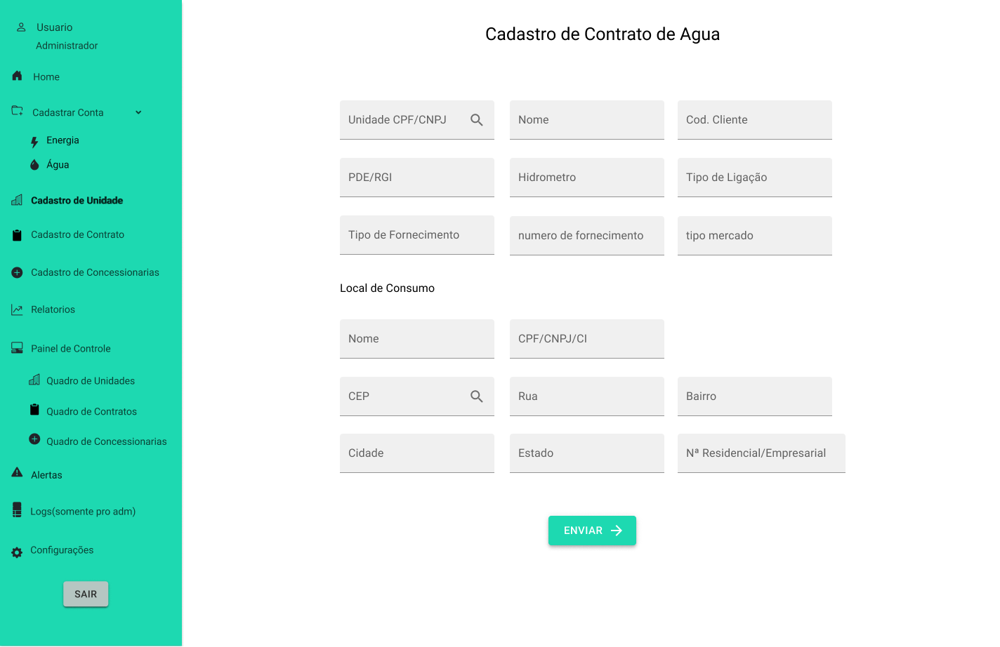

# Portifólio das APIs - Julio Cesar

<p align="justify">Portfólio das API(Aprendizagem por Projetos Integrados), elaborados do primeiro semestre ate o sexto semestre do curso de banco de dados da Faculdade de Tecnologia Fatec </p>

## Sumário

- [Sobre Mim](#sobre-mim)

- [Meus projetos](#meus-projetos)

  - [1º Semestre 1/2021 - ONG Vó Maria Félix](#1º-semestre---ong-vó-maria-félix)

  - [2º Semestre 2/2021 - Jetsoft](#2º-semestre---jetsoft)

  - [3º Semestre 1/2022 - Tecsus](#3º-semestre---tecsus)

  - [4º Semestre 2/2023 - Jaia](#4º-semestre---jaia)

- <a href="#sem5">5º Semestre 1/2024 - Tecsus</a>

- <a href="#sem6">6º Semestre 2/2024 - </a>

## Sobre Mim

<p align="center" ></p>

## Meus projetos

### 1/2021 | [Repositório](https://github.com/juliocesar1316/Projeto-Site-Intitucional)

### 1º Semestre - ONG Vó Maria Félix

Parceiro Acadêmico: [Faculdade de Tecnologia de São José dos Campos](https://fatecsjc-prd.azurewebsites.net/)

A proposta do projeto foi a elaboração de um website institucional visando a melhoria da visibilidade do centro de convivência infantil vó Maria Felix para o público de modo geral, onde o usuário poderá facilmente ter o acesso à informação sobre a ONG como: sua criação, história, funcionamento e os projetos em andamento.

Os interessados em ajudar na causa poderão fazer inscrição para ser voluntariado, doações, projetos / parcerias e podem ajudar compartilhando a ONG através do site.

### Etapas de Desenvolvimento

[Protótipo do Projeto](https://marvelapp.com/prototype/144cf1c4/screen/77188628)

### Prévia da Solução

### Tecnologias Utilizadas

[Marvel:](https://marvelapp.com/) Desenvolvimento do protótipo do site

[HTML:](https://developer.mozilla.org/pt-BR/docs/Web/HTML) Estruturar o conteúdo de páginas web

[CSS:](https://developer.mozilla.org/pt-BR/docs/Web/CSS) Estilizar e layoutar esses conteúdos.

[MySQL:](https://www.mysql.com/) Gerenciamento de banco de dados relacional usado para armazenar e recuperar dados de forma eficiente

[PHP:](https://www.php.net/") Desenvolver páginas web dinâmicas e interativas
<br>

### Contribuições Pessoais

<br>

### Hard Skills

| Hard Skills  |                                                            Utilização                                                            | Nível de proficiência |
| :----------: | :------------------------------------------------------------------------------------------------------------------------------: | :-------------------: |
|    Marvel    |                               Desenvolvi habilidades na montagem de um prototipo dinamico de site                                |       Avançado        |
|  HTML e CSS  |                         Desenvolvi habilidades na montagem de uma estrutura e estilização de pagina web                          |     Intermediário     |
|     PHP      |  Utilizado para montagem da interatividade e dinamica do site, realizado em conjunto com equipe, porem com atividades autonomas  |     Intermediário     |
|    MYSQL     | Utilizado para gerenciamento e armazenamento dos dados do site, realizado em conjunto com equipe, porem com atividades autonomas |     Intermediário     |
| GIT e GITHUB |      Utilizado controle e versionamento do projeto, realizado em conjunto com equipe, porem com utilização de facilitadores      |        Basico         |

### Soft Skills

|    Soft Skills     |                                      Utilização                                      |
| :----------------: | :----------------------------------------------------------------------------------: |
|    Comunicação     | Utilziado para viabilizar reunioes com o time e a comunicação de atividades em grupo |
|    Criatividade    |                  Utilizado na hora de produzir o prototipo do site                   |
|   Adaptabilidade   |   Utilizado no projeto e na produção, pois estavamos trabalhando no formato online   |
| Pensamento crítico |  Capacidade de analisar informações de forma lógica e tomar decisões fundamentadas   |

[Voltar ao inicio](#sumário)

<br>

### 2/2021 | [Repositório](https://github.com/juliocesar1316/JetSoft)

### 2º Semestre - JetSoft

Parceiro Acadêmico: [JetSoft](https://jetsoft.com.br/)

O projeto foi elaborado para produzir um website para uma empresa de softwares que terceiriza serviços, onde ela terá a funcionalidade de emitir relatórios mensais apresentando o quadro de presença de colaboradores em posto de trabalhos acordados em contrato que passarão por um nível de aprovação.

Devido ao problema de falta de colaboradores se a empresa tiver acima de 20% de postos de trabalho em abertos, o mesmo paga multa de 35% do valor total do contrato e para que isso seja evitado outra funcionalidade do projeto e o quadro de colaboradores que possuirá alocações fixas e flutuantes parra caso ocorra eventos (férias, falta não justificada, licença diversas, demissão, entre outros).

### Etapas de desenvolvimento

[Protótipo do Projeto](https://www.figma.com/design/0UK8InkkU5tLYeUhO8H9q4/JetSoft?m=dev&node-id=0%3A1&t=Imaw2PiYsY9z34PL-1)

### Prévia da Solução

### Tecnologias Utilizadas

[Figma:](https://www.figma.com/) Desenvolvimento do prototipo do site

[HTML](https://developer.mozilla.org/pt-BR/docs/Web/HTML) Para estruturar o conteúdo de páginas web

[CSS:](https://developer.mozilla.org/pt-BR/docs/Web/CSS) Para estilizar e layoutar esses conteúdos

[Javascript:](https://developer.mozilla.org/pt-BR/docs/Web/JavaScript) Para desenvolver a dinamicidade e a interatividade do app

[MySQL:](https://www.mysql.com/) Para gerenciamento de banco de dados relacional usado para armazenar e recuperar dados de forma eficiente

[Flask:](https://flask.palletsprojects.com/en/3.0.x/) Micro framework para Python usado para desenvolver aplicações web

### Contribuições Pessoais

### Hard Skills

| Hard Skills  |                                                       Utilização                                                        | Nível de proficiência |
| :----------: | :---------------------------------------------------------------------------------------------------------------------: | :-------------------: |
|    Figma     |                          Desenvolvi conhecimento na montagem de prototipos e layouts para site                          |     Intermediário     |
|  HTML e CSS  |                     Desenvolvi habilidades na montagem de uma estrutura e estilização de pagina web                     |     Intermediário     |
|  Javascript  |           Desenvoli habilidades de criar scripts para deixar o site mais interativo e dinamico para o usuario           |     Intermediário     |
|    MYSQL     | Desenvolvi habilidades e conheicmentos no gerencimaneto de databases e tabelas alem de monatgem de querys para consulta |     Intermediário     |
|    Flask     |           Desenvolvi habilidades em criar api rest e a conexão do front end com o back end no mesmo framework           |     Intermediário     |
| GIT e GITHUB |                           Aprendi a utilizar os comandos do git e seu funcionamento no github                           |     Intermediário     |

### Soft Skills

|          Soft Skills          |                                                       Utilização                                                       |
| :---------------------------: | :--------------------------------------------------------------------------------------------------------------------: |
|          Comunicação          |                  Utilziado para viabilizar reunioes com o time e a comunicação de atividades em grupo                  |
|         Criatividade          |                                   Utilizado na hora de produzir o prototipo do site                                    |
|        Adaptabilidade         |                    Utilizado no projeto e na produção, pois estavamos trabalhando no formato online                    |
|      Pensamento crítico       |                   Capacidade de analisar informações de forma lógica e tomar decisões fundamentadas                    |
|    Resolução de Conflitos     | Habilidade para mediar conflitos dentro da equipe de maneira construtiva e promover um ambiente de trabalho harmonioso |
| Organização e Gestão do Tempo | Competência para manter a equipe organizada e garantir que as tarefas sejam concluídas dentro dos prazos estabelecidos |

[Voltar ao inicio](#sumário)

<br>

### 1/2022 | [Repositório](https://github.com/juliocesar1316/TecSus)

### 3º Semestre - Tecsus

Parceiro Acadêmico: [Tecsus](https://tecsus.com.br/)

O projeto foi elaborado para produzir um software de gerenciamento de contas para uma startup que busca por meio da tecnologia tornar o planeta mais sustentável.

O sistema será desenvolvido para que o processo de cadastramento de contas, unidade, concessionarias e contratos possa ser simples e intuitivo, além de proporcionar ao usuário uma experiência mais dinâmica ao exibir as informações relevantes através de relatórios e gráficos descomplicados para análise

### Etapas de Desenvolvimento

### Prévia da Solução

### Tecnologias Utilizadas

[Figma:](https://www.figma.com/) Desenvolvimento do prototipo do site

[HTML](https://developer.mozilla.org/pt-BR/docs/Web/HTML) Para estruturar o conteúdo de páginas web

[CSS:](https://developer.mozilla.org/pt-BR/docs/Web/CSS) Para estilizar e layoutar esses conteúdos

[React:](https://pt-br.legacy.reactjs.org/) Framework do javascript utilizado na construção de interfaces de usuário interativas e dinâmicas em aplicações web.

[Spring Boot:](https://spring.io/projects/spring-boot) Framework Java que simplifica o desenvolvimento de aplicativos robustos e escaláveis, oferecendo configuração mínima e alto desempenho.

[MySQL:](https://www.mysql.com/) Para gerenciamento de banco de dados relacional usado para armazenar e recuperar dados de forma eficiente

### Contribuições Pessoais

Neste projeto eu estava atuando como Product Owner, onde era responsável pelo contato com cliente, definição de user storys, priorização do backlog e para este projeto eu realizei o design do mockup do aplicativo.

Após o contato com o cliente, foi possível a definição dos user storys e do mockup onde foi utilizado a ferramenta figma.

<details>
<summary>User Story</summary>

| User Story ID |                                       Como um (ator)                                       |                                                               Eu quero (ação)                                                               |                                                                          Para que seja possível (funcionalidade)                                                                          | Prioridade |
| :-----------: | :----------------------------------------------------------------------------------------: | :-----------------------------------------------------------------------------------------------------------------------------------------: | :---------------------------------------------------------------------------------------------------------------------------------------------------------------------------------------: | :--------: |
|       1       |                                         Digitador                                          |                    Guardar no sistema os dados das contas de água para análises, relatórios e ter um controle de sistema                    |                                                             Criar um cadastro de conta de água de maneira funcional e prático                                                             |     1      |
|       2       |                                         Digitador                                          |                  Guardar no sistema os dados das contas de energia para análises, relatórios e ter um controle de sistema                   |                                                           Criar um cadastro de conta de energia de maneira funcional e prático                                                            |     2      |
|       3       |                                         Digitador                                          |                  Guardar no sistema dados de unidades e ou empresas para análises, relatórios e ter um controle de sistema                  |                                                               Criar um cadastro de unidades de maneira funcional e prático                                                                |     3      |
|       4       |                                         Digitador                                          | Guardar no sistema dados de concessionaria que faz o fornecimento para tais unidades para análises, relatórios e ter um controle de sistema |                                                            Criar um cadastro de concessionarias de maneira funcional e prático                                                            |     4      |
|       5       |                                         Digitador                                          |           Cadastrar os contratos acordado com os clientes e unidade com sua respectiva concessionaria do segmento de água/esgoto            |                                                                 Criar um cadastro de contrato para contas de água/esgoto                                                                  |     5      |
|       6       |                                         Digitador                                          |             Cadastrar os contratos acordado com os clientes e unidade com sua respectiva concessionaria do segmento de energia              |                                                                   Criar um cadastro de contrato para contas de energia                                                                    |     6      |
|       7       |                                       Administrador                                        |                Os dados de unidade, concessionaria e contratos devem ser interligados para melhor controle e busca de dados                 |                               Criar bancos de dados relacional ligando uma unidade para um ou varios contratos e os contratos ligados a uma concessionaria                                |     8      |
|       8       |                                           Gestor                                           |               Fazer analises tecnicas/financeiras, comparar, fazer medias e ter um controle mensal e anual das contas de agua               |      Criar uma area com relatorios e graficos dessa contas de agua com metodos de filtragem e onde vai poder visualizar as contas de agua cadastradas, multas e desperdicio de agua       |     9      |
|       9       |                                           Gestor                                           |             Fazer analises tecnicas/financeiras, comparar, fazer medias e ter um controle mensal e anual das contas de energia              | Criar uma area com relatorios e graficos dessa contas de energia com metodos de filtragem e onde vai poder visualizar as contas de energia cadastradas , multas e desperdicio de energia  |     10     |
|      10       |                                           Gestor                                           |                               Ao entrar poder ver alguns graficos e dados do sistema para controles iniciais                                |                                          Criar uma area de dashboard onde vai ser a primeira pagina do sistema com graficos e dados informativos                                          |     11     |
|      11       |                                           Gestor                                           |                                          Um metodo que avise os alertas de consumo acima da media                                           |                                                 Criar uma area onde vai ter exibir os alertas de consumo acima da media e outros alertas                                                  |     12     |
|      12       |                                           Gestor                                           |                                 Um metodo que de para visualizar os dados com os parametros setados por mim                                 |                               Na aba de relatorios vai ser criado alguns campos para que seja adicionados os parametros e filtrar todos os dados dessa area                               |     13     |
|      13       |                                           Gestor                                           |                              Visualizar todas as unidades cadastradas e poder editar e excluir se for preciso                               |                              Criar uma aba de controle de dados onde vai ter uma tabela com todas as unidades cadastradas com icones para excluir e editrar                               |     14     |
|      14       |                                           Gestor                                           |                              Visualizar todas as unidades cadastradas e poder editar e excluir se for preciso                               |                           Criar uma aba de controle de dados onde vai ter uma tabela com todas as concessionarias cadastradas com icones para excluir e editrar                           |     15     |
|      15       |                                           Gestor                                           |                              Visualizar todos os contratos cadastrados e poder editar e excluir se for preciso                              |                              Criar uma aba de controle de dados onde vai ter uma tabela com todos os contratos cadastradas com icones para excluir e editrar                              |     16     |
|      16       | Digitador Atalhos para que a digitação das contas e os cadstros sejam mais rapidos e facil |              Criar atalhos como buscar cpf onde retorna os dados sobre aquele cpf digitado, metodo de tabs e setas do teclado               |                                                                                            17                                                                                             |
|      17       |                                           Gestor                                           |                                   Um modo de saber que os cadastros foram feitos, editados e ou excluidos                                   |                                            Criar um metodo de registro de logs onde a cada cadastro, edicao ou exclusao ele registrara no log                                             |     18     |
|      18       |                                          Cliente                                           |                                  Ter uma segurança de acesso ao sistema para que não fique aberto a todos                                   |                                                            Criar uma tela de login para que a pessoa entre com usario e senha                                                             |     19     |
|      19       |                                          Cliente                                           |                                     Niveis de acesso no sistema para administrador, gestor e digitador                                      |                                              Criar um cadastro master(administrador) para que possa criar os subniveis de acesso ao sistema                                               |     20     |
|      20       |                                         Digitador                                          |                                           Armazenar o arquivo da conta que acabou de ser digitada                                           |                                          Criar um metodo que possa fazer o upload do pdf, imagem, etc da conta para armazenar no banco de dados                                           |     21     |
|      21       |                                           Gestor                                           |                          Imprimir e ou guardar em meu computador os relatorios gerados pelo sistema em formato pdf                          |                                                     Criar um metodo que imprima na tela os relatorios que foram gerados para dowload                                                      |     22     |
|      23       |                             Gestor, Digitador e Adminnistrador                             |                        Um sistema com bastante atalhos, que fique bem usual para os usuarios e de facil entendimento                        | O sistema deve ser montado com menu lateral esquerdo com as abas de acesso totalmente limpo e de facil acesso e para areas externas do menu vao ser utilizados mais ou menos 100% da tela |     23     |

</details>

<br>

<details>
  <summary>Mockup do projeto</summary>

  <br>
  
  - Formulario concessionaria


- Formulario Unidade


- Contrato Agua



- Contrato Energia


- Conta Agua


- Conta Energia


- Quadro Concessionaria


- Modal Quadro Concessionaria


- Modal Quadro Concessionaria Update


- Quadro Unidade


- Modal Quadro Unidade


- Modal Quadro Unidade Update


- Quadro Contrato Agua


- Modal Quadro Contrato Agua


- Modal Quadro Contrato Agua Update


- Quadro Contrato Energia


- Modal Quadro Contrato Energia


- Modal Quadro Contrato Energia Update


- Tela Login


- Alertas de Consumo


- Relatório de Contas Agua


- Gráfico Consumo Mês Agua


- Gráfico Valor Total Mês Agua


- Relatório de Contas Energia


- Gráfico Consumo Mês Energia


- Gráfico Valor Total Mês Energia


</details>

<br>

Após cliente aprovar o mockup e a priorização de backlog, podemos começar a organizar os grupos de back-end e front-end. Para este projeto foi utilizado as linguagens React para front-end, Spring Boot para back-end e para o banco de dados foi utilizado o Mysql. As linguagens foram utilizadas por serem requisitos e pela preferência do grupo.

Apesar de esta operando como Product Owner, possuo algumas experiencias com React e como meu grupo não tinha pessoas para o front eu decidi conciliar o PO com o desenvolvimento do front-end.

De começo para auxiliar na programação das telas foi utilizado a biblioteca MaterialUi onde foi utilizado campos de input, botões e estilos. Como o react trabalha com componentes no nosso projeto não foi diferente, para cada parte das páginas foi criado um componente para facilitar na programação e userStates para que seja feito o controle do estado das variáveis.

<details>
  <summary>Modal de editar a concessionaria</summary>
  ```

    export default function EditConcessionaria({ dados, modalEdit }) {

    const classes = useStyles();
    const [cnpj, setCnpj] = useState(dados.cnpj);
    const [nome, setNome] = useState(dados.nome);
    const [segmento, setSegmento] = useState(dados.segmento);
    const [cep, setCep] = useState(dados.cep);
    const [rua, setRua] = useState(dados.rua);
    const [bairro, setBairro] = useState(dados.bairro);
    const [estado, setEstado] = useState(dados.uf);
    const [cidade, setCidade] = useState(dados.cidade);
    const [num_resid, setNum_resid] = useState(dados.numero);
    const [telefone, setTelefone] = useState(dados.telefone);
    const [inscricao_est, setInscricao_est] = useState(dados.inscricao_estadual);
    const [inscricao_unic, setInscricao_unic] = useState(
      dados.inscricao_especial
    );

    async function handleUpdate() {
      const data = {
        id: dados.id,
        cnpj: cnpj,
        nome: nome,
        segmento: segmento,
        cep: cep,
        rua: rua,
        bairro: bairro,
        cidade: cidade,
        uf: estado,
        numero: num_resid,
        telefone: telefone,
        inscricao_estadual: inscricao_est,
        inscricao_especial: inscricao_unic,
      };
      await fetch(`${baseURL}/concessionaria/atualizar`, {
        method: "PUT",
        headers: {
          "Content-Type": "application/json",
        },
        body: JSON.stringify(data),
      });
    }

    return (
      <form className={classes.root} onSubmit={handleUpdate}>
        <div className={classes.campo}>
          <TextField
            className={classes.text}
            required
            id="outlined-required"
            label="CNPJ"
            variant="outlined"
            fullWidth
            onChange={(e) => setCnpj(e.target.value)}
            value={cnpj}
          />
    ...
    )
    ```

</details>

<br>

O componente que foi criado acima é um Modal que aonde retorna os dados que foram salvos e edita as informações. Usando o useState é possível guardar o dado salvo e editá-lo como segundo estado da variável. A função handleUpdate é executado após apertar o botão de enviar onde ele pega todas as alterações e atualiza os dados. No returno desse componente tem os inputs e as label que serão mostradas nesse modal.

Esse é um exemplo de um componente de dados que retorna os dados da concessionaria para editar e assim como esse outros foram montados como inserir, editar e excluir dados do app.

Para última sprint foi acordado com o cliente que era para ser inserido uma página de relatório com gráficos relacionados a contas de água e contas de energia inseridos.

Para o gráfico optei por utilizar a biblioteca recharts para react onde ele consegue gerar um gráfico com os dados das contas.

<details>
  <summary>Componente de grafico da agua usado na pagina de relatorios</summary>
  ```

    import {
      AreaChart,
      XAxis,
      YAxis,
      CartesianGrid,
      Tooltip,
      Area,
    } from "recharts";
    import FormControl from "@material-ui/core/FormControl";
    import RadioGroup from "@material-ui/core/RadioGroup";
    import FormControlLabel from "@material-ui/core/FormControlLabel";
    import { useState } from "react";
    import Radio from "@material-ui/core/Radio";
    import "./style.css";

    function GraficoAgua({ listaRelatorioAguas }) {
      const [variavelY, setVariavelY] = useState();
      const [legenda, setLegenda] = useState();
      const [checked, setChecked] = useState("Valor Total R$");

      const handleChange = (event) => {
        setChecked(event.target.value);
      };

      const dataConsumo = listaRelatorioAguas.map((x) => {
        const arrayData = x.data_emissao.split("-");
        const ano = `${arrayData[0]}`;
        const mes = `${arrayData[1]}`;
        return {
          name: `${mes}/${ano}`,
          uv: x.consumo_m3,
        };
      });

      const daTaValorTotal = listaRelatorioAguas.map((x) => {
        const arrayData = x.data_emissao.split("-");
        const ano = `${arrayData[0]}`;
        const mes = `${arrayData[1]}`;
        return {
          name: `${mes}/${ano}`,
          uv: x.valor_total,
        };
      });

      return (
        <div className="main-dados">
          <div className="Agua">
            <AreaChart
              width={900}
              height={450}
              data={variavelY ? variavelY : daTaValorTotal}
              margin={{ top: 30, right: 20, left: 0, bottom: 0 }}
            >
              <defs>
                <linearGradient id="colorUv" x1="0" y1="0" x2="0" y2="2">
                  <stop offset="5%" stopColor="#5664D2" stopOpacity={0.8} />
                  <stop offset="95%" stopColor="#5664D2" stopOpacity={0} />
                </linearGradient>
              </defs>
              <XAxis dataKey="name" />
              <YAxis />
              <CartesianGrid strokeDasharray="3 3" />
              <Tooltip />
              <Area
                type="monotone"
                name={legenda ? legenda : "Valor Total (R$)"}
                dataKey="uv"
                stroke="#5664D2"
                fillOpacity={1}
                fill="url(#colorUv)"
              />
            </AreaChart>
          </div>
          <div className="buttons">
            <FormControl component="fieldset">
              <RadioGroup row value={checked} onChange={handleChange}>
                <FormControlLabel
                  value="Valor Total R$"
                  control={<Radio />}
                  label="Valor Total R$"
                  onClick={() => {
                    setVariavelY(daTaValorTotal);
                    setLegenda("Valor Total (R$)");
                  }}
                />
                <FormControlLabel
                  value="Consumo Mês (M³)"
                  control={<Radio />}
                  label="Consumo Mês (M³)"
                  onClick={() => {
                    setVariavelY(dataConsumo);
                    setLegenda("Consumo Mês (M³)");
                  }}
                />
              </RadioGroup>
            </FormControl>
          </div>
        </div>
      );
    }

    export default GraficoAgua;
    ```

</details>

<br>

O código acima monta o gráfico através dos dados recebidos no JSON do back-end e filtra de acordo com os valor total mensal e consumo mensal.

<details>
  <summary>Gif do grafico e filtros</summary>
  
  <br>


</details>

<br>

E com isso é finalizado a api, colocamos o back-end no heroku para facilitar na requisição de dados do front-end e conseguimos entregar um bom projeto, o cliente ficou satisfeito com o resultado.

Porém nesta api eu estava como product owner porém dois integrantes que ficaram na parte do front não acabaram ajudando muito, então acabei que fiquei mais empenhado como desenvolvedor, mas nunca deixando minhas tarefas como product owner de lado.

### Hard Skills

### Soft Skills

[Voltar ao inicio](#sumário)

<br>

### 2/2023 | [Repositório](https://github.com/B1nary-Devs/JAIA-SOFTWARE)

### 4º Semestre - Jaia

Parceiro Acadêmico: [Jaia](https://www.jaia.software/)

### Etapas de Desenvolvimento

### Prévia da Solução

### Tecnologias Utilizadas

### Contribuições Pessoais

### Hard Skills

### Soft Skills

[Voltar ao inicio](#sumário)
