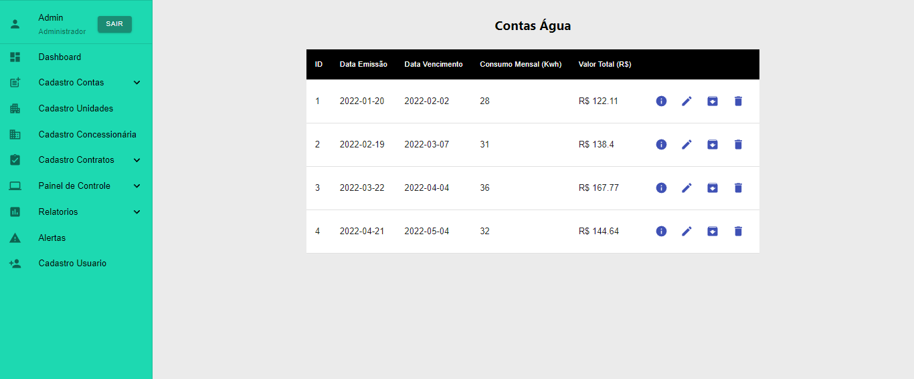
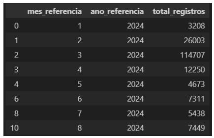
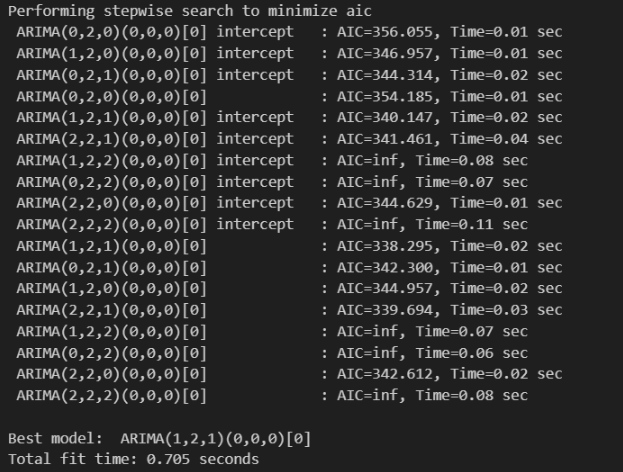

# Portifólio das APIs - Julio Cesar

<p align="justify">Portfólio das API (Aprendizagem por Projetos Integrados), elaborados do primeiro semestre até o sexto semestre do curso de banco de dados da Faculdade de Tecnologia Fatec. </p>

## Sumário

- [Sobre Mim](#sobre-mim)

- [Meus projetos](#meus-projetos)

  - [1º Semestre 1/2021 - ONG Vó Maria Félix](#1º-semestre---ong-vó-maria-félix)

  - [2º Semestre 2/2021 - Jetsoft](#2º-semestre---jetsoft)

  - [3º Semestre 1/2022 - Tecsus](#3º-semestre---tecsus)

  - [4º Semestre 2/2023 - Jaia](#4º-semestre---jaia)

  - [5º Semestre 1/2024 - Tecsus](#5º-semestre---tecsus)

  - [6º Semestre 2/2024 - SPC](#6º-semestre---spc)

## Sobre Mim

<p align="center" >

E aí, pessoal! Sou desenvolvedor Full Stack e estou sempre buscando evoluir como desenvolvedor. Adoro café, música e viagens de moto, e busco desafios cada vez mais estimulantes.

Minha paixão por tecnologia começou durante a graduação em Engenharia Aeronáutica, onde tive meu primeiro contato com programação em C. Esse momento inicial despertou meu interesse por lógica de programação e resolução de problemas. Em 2021, decidi me aprofundar na área e iniciei o tecnólogo em Análise e Desenvolvimento de Sistemas pela Fatec. Nesse período, fui selecionado para participar de um curso intensivo de desenvolvimento Full Stack oferecido pelo iFood, que me proporcionou uma base sólida e prática em Desenvolvimento Web, APIs REST, Banco de Dados e versionamento de código.

Concluí o programa com habilidades para enfrentar desafios em projetos Full Stack, com foco em programação, orientação a objetos e boas práticas de desenvolvimento. No segundo semestre de 2022, optei por migrar para o curso de Banco de Dados, uma área com a qual me identifiquei e que também se encaixava melhor na minha rotina, sendo oferecida no período noturno. Essa decisão reforçou meu aprendizado e expandiu ainda mais meu leque de conhecimentos na área de tecnologia.

A Fatec também tem sido um ambiente de aprendizado desafiador e prático. Por meio do método API (Aprendizagem por Projetos Integrados), desenvolvemos projetos complexos com especificações reais de empresas parceiras. Todo semestre, os projetos abrangem o ciclo completo de desenvolvimento: back-end, front-end e banco de dados, com um forte foco em lógica de programação e arquitetura de sistemas.

</p>

## Meus projetos

### 1/2021 | [Repositório](https://github.com/juliocesar1316/Projeto-Site-Intitucional)

### 1º Semestre - ONG Vó Maria Félix

Parceiro Acadêmico: [Faculdade de Tecnologia de São José dos Campos](https://fatecsjc-prd.azurewebsites.net/)

O projeto teve como proposta a criação de um website institucional para o Centro de Convivência Infantil Vó Maria Felix, com o objetivo de melhorar sua visibilidade para o público em geral. Por meio do site, os usuários podem acessar informações sobre a ONG, incluindo sua criação, história, funcionamento e projetos em andamento.

Além disso, o site oferece a possibilidade de inscrição para os interessados em se voluntariar e contribuir com a causa, facilitando o engajamento e a participação de novos apoiadores.

### Etapas de Desenvolvimento


[Protótipo do Projeto](https://marvelapp.com/prototype/144cf1c4/screen/77188628)

### Prévia da Solução

### Tecnologias Utilizadas

[Marvel:](https://marvelapp.com/) Desenvolvimento do protótipo do site.

[HTML:](https://developer.mozilla.org/pt-BR/docs/Web/HTML) Estruturar o conteúdo de páginas web.

[CSS:](https://developer.mozilla.org/pt-BR/docs/Web/CSS) Estilizar e personalizar esses conteúdos.

[MySQL:](https://www.mysql.com/) Gerenciamento de banco de dados relacional usado para armazenar e recuperar dados de forma eficiente.

[PHP:](https://www.php.net/") Desenvolver páginas web dinâmicas e interativas.
<br>

### Contribuições Pessoais

Nesse primeiro semestre, desenvolvemos um projeto para uma ONG escolar com o objetivo de criar um site que permitisse aos usuários conhecerem suas causas e atividades.

Como metodologia, utilizamos o Scrum, embora, neste período, não tivéssemos um Product Owner definido. Por isso, fiquei encarregado de desenvolver o protótipo do projeto. Apesar de ser minha primeira experiência em prototipação e criação de layouts, enfrentei alguns desafios durante o processo. No entanto, ao final da Sprint 0, consegui alcançar um bom resultado, contribuindo para a definição inicial do projeto.

<details>
  <summary>Layouts do Site</summary>
  <br>

- Layout Menu


- Layout Home


- Layout Cadastro


</details>

<br>

Na primeira sprint, após a conclusão do protótipo do site, iniciamos o desenvolvimento. Minha primeira tarefa foi configurar o XAMPP para permitir o uso do PHP e do MySQL localmente. Com o ambiente configurado, o grupo pôde dar início ao desenvolvimento do projeto.

Esse foi meu primeiro contato com HTML e PHP, e, embora tenha encontrado algumas dificuldades iniciais, consegui superá-las com a ajuda dos colegas. Como resultado, desenvolvi a tela de doação, onde é realizado o cadastro do doador e dos dados para a doação, além da tela de participantes, destinada ao cadastro de participantes. Também colaborei no desenvolvimento da tela de voluntários, onde são registrados os voluntariados da ONG.

Como todos os desenvolvedores do grupo eram iniciantes, seguimos uma abordagem simples: o back-end foi implementado em PHP, o front-end com HTML e CSS, e o banco de dados foi estruturado no MySQL.

<details>
  <summary> Tela de Doação, Participante e Voluntario</summary>
  <br>

- Tela Doação


- Tela Participante


- Tela Voluntarios


</details>

<br>

Na segunda sprint, fui responsável pela criação das telas de contato, onde é exibido o endereço da escola junto a um formulário para contato; da tela de projetos, que apresenta os projetos sociais da instituição e inclui um formulário para solicitar novos projetos; e da tela sobre a escola, que traz informações detalhadas sobre a instituição.

Nesta sprint, assim como na anterior, fiquei encarregado do desenvolvimento das telas, enquanto os demais desenvolvedores trabalharam na implementação do captcha, na criação da tela para o administrador editar os textos do site e na tela de login.

<details>
  <summary> Tela de Contato, Projeto e Sobre</summary>
  <br>

- Tela Contato


- Tela Projeto


- Tela Sobre


</details>

<br>

Na terceira sprint, com todas as telas já concluídas, decidimos implementar as funcionalidades destinadas aos administradores. O site passou a contar com um método que permite ao administrador gerenciar o conteúdo exclusivamente por meio de uma tela específica. Nessa tela, o administrador pode atualizar textos e imagens do site, além de aprovar ou reprovar usuários.

Como desenvolvedor, fui responsável pela estilização e pela criação da interface da tela do administrador, bem como pela configuração de um banco de dados alternativo ao MySQL para exibição das informações do site.

<details>
  <summary> Tela banco de dados admin e telas editaveis</summary>
  <br>

- Tela Banco de Dados


- Tela Sobre Editavel


</details>

<br>

Na quarta e última sprint, fiquei encarregado de corrigir alguns bugs.

No final, conseguimos entregar um projeto de qualidade. Foi um grande desafio, pois era o primeiro contato com programação para o grupo, mas com a ajuda de todos e o suporte dos professores, conseguimos realizar uma boa entrega.

Vídeo do site institucional.

[Video institucional](https://www.youtube.com/watch?v=9K1p-P8zGd8)

<br>

### Hard Skills

| Hard Skills  |                                                             Utilização                                                              | Nível de proficiência |
| :----------: | :---------------------------------------------------------------------------------------------------------------------------------: | :-------------------: |
|    Marvel    |                                Desenvolvi habilidades na montagem de um protótipo dinâmico de site.                                 |       Intermediario        |
|  HTML e CSS  |                         Desenvolvi habilidades na montagem de uma estrutura e estilização de páginas web.                           |     Basico     |
|     PHP      |  Utilizado para montagem da interatividade e dinâmica do site, realizado em conjunto com a equipe, porém com atividades autônomas.  |     Basico     |
|    MYSQL     | Utilizado para gerenciamento e armazenamento dos dados do site, realizado em conjunto com a equipe, porém com atividades autônomas. |     Basico     |
| GIT e GITHUB |      Utilizado controle e versionamento do projeto, realizado em conjunto com a equipe, porém com utilização de facilitadores.      |        Basico         |

### Soft Skills

|    Soft Skills     |                                      Utilização                                       |
| :----------------: | :-----------------------------------------------------------------------------------: |
|    Comunicação     | Utilizado para viabilizar reuniões com o time e a comunicação de atividades em grupo. |
|    Criatividade    |                  Utilizado na hora de produzir o protótipo do site.                   |
|   Adaptabilidade   |   Utilizado no projeto e na produção, pois estávamos trabalhando no formato online.   |
| Pensamento crítico |  Capacidade de analisar informações de forma lógica e tomar decisões fundamentadas.   |

[Voltar ao inicio](#sumário)

<br>

### 2/2021 | [Repositório](https://github.com/juliocesar1316/JetSoft)

### 2º Semestre - JetSoft

Parceiro Acadêmico: [JetSoft](https://jetsoft.com.br/)

O projeto foi desenvolvido para criar um website para uma empresa de software que terceiriza serviços. O site terá a funcionalidade de emitir relatórios mensais, apresentando o quadro de presença dos colaboradores nos postos de trabalho acordados em contrato, os quais passarão por um processo de aprovação.

Considerando o problema da falta de colaboradores, caso a empresa tenha mais de 20% de postos de trabalho abertos, será aplicada uma multa de 35% do valor total do contrato. Para evitar essa situação, o projeto inclui uma funcionalidade de quadro de colaboradores, que terá alocações fixas e flutuantes. Isso permitirá ajustes caso ocorram eventos como férias, faltas não justificadas, licenças diversas, demissões, entre outros.

### Etapas de Desenvolvimento


[Protótipo do Projeto](https://www.figma.com/design/0UK8InkkU5tLYeUhO8H9q4/JetSoft?m=dev&node-id=0%3A1&t=Imaw2PiYsY9z34PL-1)

### Prévia da Solução

### Tecnologias Utilizadas

[Figma:](https://www.figma.com/) Desenvolvimento do protótipo do site.

[HTML](https://developer.mozilla.org/pt-BR/docs/Web/HTML) Para estruturar o conteúdo de páginas web.

[CSS:](https://developer.mozilla.org/pt-BR/docs/Web/CSS) Para estilizar e personalizar esses conteúdos.

[Javascript:](https://developer.mozilla.org/pt-BR/docs/Web/JavaScript) Para desenvolver a dinamicidade e a interatividade do app.

[MySQL:](https://www.mysql.com/) Para gerenciamento de banco de dados relacional usado para armazenar e recuperar dados de forma eficiente.

[Flask:](https://flask.palletsprojects.com/en/3.0.x/) Micro framework para Python usado para desenvolver aplicações web.

### Contribuições Pessoais

Neste segundo semestre, realizamos um projeto web para o controle de funcionários que terceirizam seus serviços, utilizando a metodologia ágil Scrum. Optei por assumir o papel de Scrum Master do time. No início, como o Product Owner não tinha experiência em prototipação e criação de layouts, alinhei com todos os integrantes da equipe para que pudessem ajudar na montagem do projeto. Juntos, definimos e estruturamos o layout, garantindo que o menu do aplicativo fosse organizado e as funções subsequentes fossem posicionadas de forma clara e acessível.

<details>
  <summary>Layout Base</summary>
  <br>

- Layout Base


</details>

<br>

Após o protótipo ser finalizado, organizamos as tarefas para que cada integrante do time assumisse responsabilidades específicas. Para garantir um controle mais eficaz do projeto, como Scrum Master, alinhei com o time a realização de reuniões diárias (dailys) após a faculdade, para compartilharmos o progresso das tarefas e o andamento geral do projeto. Essa abordagem foi muito proveitosa, pois o time conseguiu avançar consideravelmente, entregando resultados de forma consistente. Sempre que algum desenvolvedor enfrentava dificuldades, eu e os outros membros da equipe nos uníamos para oferecer ajuda.

Na primeira sprint, após a aceitação do protótipo e o alinhamento das regras e tarefas, o projeto foi iniciado. Para garantir que o time tivesse foco na construção do aplicativo, comecei desenvolvendo a tela base, que seria utilizada em todo o projeto. Ela incluía um menu interativo e as margens corretamente ajustadas para as funções. Além disso, para o desenvolvimento do projeto, utilizamos o framework Flask do Python. Enquanto a equipe avançava no desenvolvimento, aproveitei para estudar e me aprofundar para poder auxiliar os demais. Isso se mostrou útil, pois o pessoal do back-end estava encontrando dificuldades para desenvolver a API REST no Flask. Para ajudar, criei duas rotas: uma para o controle de presença e outra para o cadastro de colaboradores, que serviram como exemplos para o time.

<details>
  <summary>Rotas Utilizando Flask</summary>

  <br>

```
# importando framework flask e bibliotecas para usar servicoes web
from flask import Flask, render_template, request, redirect, url_for, flash

# importando biblioteca para conectar com mysql
from flaskext.mysql import MySQL

mysql = MySQL()
# iniciando variavel app
app = Flask(__name__)
app.secret_key = "flash message"

# configurando conexão com banco de dados
app.config['MYSQL_DATABASE_USER'] = 'root'
app.config['MYSQL_DATABASE_PASSWORD'] = ''
app.config['MYSQL_DATABASE_DB'] = 'jetsoft'
app.config['MYSQL_DATABASE_HOST'] = 'localhost'

mysql.init_app(app)

# rota para a página inicial


@app.route('/')
def index():
    return render_template('/index.html')


@app.route('/controle_presenca', methods=['GET', 'POST'])
def controle():

    con = mysql.connect()
    cur = con.cursor()
    cur.execute("SELECT * FROM controle_presenca")
    data = cur.fetchall()

    if request.method == "POST":
        colaborador = request.form["colaborador"]
        dia = request.form["dia"]
        pouf = request.form["pouf"]
        cur.execute(
            "UPDATE `controle_presenca` SET `%s` = %s WHERE `colaborador` = %s", (
                dia, pouf, colaborador)
        )
        con.commit()
        return redirect(url_for('controle'))
    else:
        return render_template('/controle_presenca.html', controle=data)

# rota para a página de destino (cadastro de colaboradores)


@app.route('/cadastro_colaboradores', methods=['GET', 'POST'])
# função para tratamento dos dados
def cadastro():
    # código de conectividade com banco de dados
    con = mysql.connect()
    cur = con.cursor()
    if request.method == "POST":
        flash("Dados gravados com sucesso!")
        nome = request.form["nome"]
        cpf = request.form["cpf"]
        matricula = request.form["matricula"]
        funcao = request.form["funcao"]
        admissao = request.form["admissao"]
        email = request.form["email"]
        telefone = request.form["telefone"]
        tipo_cobertura = request.form["devweb"]
        cur.execute("INSERT INTO `colaboradores`(`nome_completo`,`cpf`,`matricula`,`funcao`,`data_admissao`,`email`,`telefone`,`tipo_cobertura`) VALUES(%s, %s, %s, %s, %s, %s, %s, %s)",
                    (nome, cpf, matricula, funcao, admissao,
                    email, telefone, tipo_cobertura)
                    )
        cur.execute(
            "INSERT INTO `controle_presenca` (`colaborador`,`funcao`,`tipo_cobertura`) VALUES (%s, %s, %s)", (
                nome, funcao, tipo_cobertura)
        )
        con.commit()
        return redirect(url_for('cadastro'))
    else:
        return render_template('/cadastro_colaboradores.html')


if __name__ == "__main__":
    app.run(debug=True)
```

</details>

<br>

<details>
  <summary>Menu interativo</summary>

  <br>

- Menu interativo


</details>

<br>

<details>
  <summary>Burndonw 1-Sprint</summary>

  <br>

- Burndonw


</details>

<br>

Na segunda sprint, após as reuniões, percebi que um dos desenvolvedores estava enfrentando dificuldades. Como Scrum Master, fui atrás dele para oferecer ajuda. Solicitei que ele compartilhasse a tela para que pudéssemos programar juntos, e foi nesse momento que percebi que ele não estava se dedicando o suficiente ao projeto. Ele não estava conseguindo entender como desenvolver corretamente e parecia um pouco perdido. Então, auxiliei-o a organizar o ambiente de desenvolvimento do projeto e, ao esclarecer alguns pontos, consegui ajudá-lo a seguir o caminho certo. Como resultado, ele conseguiu entregar sua parte com êxito nessa sprint.

Apesar de estar exercendo o papel de Scrum Master, para garantir que o projeto fosse executado corretamente, acabei revisando o código do grupo para corrigir problemas de indentação e solucionar alguns bugs nas telas. Muitas vezes, por falta de mão de obra, essas tarefas acabavam ficando sob minha responsabilidade. Em resumo, em alguns momentos, atuei como Tech Lead, mas meu foco sempre foi ajudar e organizar o tempo e as tarefas da equipe para que o projeto seguisse conforme o planejado.

<details>
  <summary>Burndonw 2-Sprint</summary>

- Burndonw


</details>

<br>

Na terceira sprint, assim como em todas as anteriores, acabei revisando o código e facilitando o caminho para a equipe. Os desenvolvedores enfrentaram dificuldades com o CSS, pois precisavam alinhar corretamente os elementos nas telas para evitar sobreposição ou que ficassem embaixo do menu lateral. Como Scrum Master e já tendo mais familiaridade com CSS, decidi ajudar a estilizar algumas telas para que os elementos ficassem no espaço desejado, permitindo que a equipe avançasse e finalizasse a maior parte do projeto. Não enfrentei muitos problemas nessa sprint. Após alinhar com os desenvolvedores, que estavam um pouco abaixo do esperado na segunda sprint, percebi uma melhoria significativa na terceira. Isso me permitiu focar mais no CSS, que realmente era um desafio, e no gerenciamento do tempo da equipe.

<details>
  <summary>Burndonw 3-Sprint</summary>

- Burndonw


</details>

<br>

Na quarta e última sprint, após o projeto ser finalizado, um dos requisitos funcionais era realizar o deploy da aplicação. No entanto, o grupo estava tendo dificuldades para realizar o deploy no Heroku. Para resolver esse problema, busquei diversas alternativas para fazer o deploy de uma aplicação Python até que encontrei a plataforma "PythonAnywhere". Enquanto a equipe se concentrava em corrigir bugs e na criação do botão de PDF, eu me dediquei a testar e implementar o deploy. Após bastante esforço, consegui subir a aplicação na plataforma e entregar o projeto.

Foi uma experiência muito gratificante e desafiadora, pois o grupo era iniciante e enfrentamos muitos obstáculos, tanto pela falta de experiência em programação quanto pela procrastinação das tasks. No final, consegui alinhar a equipe e entregamos um produto satisfatório para o cliente.

<details>
  <summary>Burndonw 4-Sprint</summary>

- Burndonw


</details>

<br>

<details>
  <summary>Projeto Finalizado</summary>
  <br>

[Video Projeto](https://www.youtube.com/watch?v=xGE51h8fBuY)

</details>

<br>

### Hard Skills

| Hard Skills  |                                                        Utilização                                                         | Nível de proficiência |
| :----------: | :-----------------------------------------------------------------------------------------------------------------------: | :-------------------: |
|    Figma     |                          Desenvolvi conhecimento na montagem de protótipos e layouts para site.                           |     Intermediário     |
|  HTML e CSS  |                    Desenvolvi habilidades na montagem de uma estrutura e estilização de páginas web.                      |     Intermediário     |
|  Javascript  |           Desenvolvi habilidades de criar scripts para deixar o site mais interativo e dinâmico para o usuário.           |     Intermediário     |
|    MYSQL     | Desenvolvi habilidades e conhecimentos no gerenciamento de databases e tabelas, além de montagem de querys para consulta. |     Intermediário     |
|    Flask     |           Desenvolvi habilidades em criar API rest e a conexão do front end com o back end no mesmo framework.            |     Intermediário     |
| GIT e GITHUB |                          Aprendi a utilizar os comandos do Git e seu funcionamento no GitHub.                             |     Basico     |

### Soft Skills

|          Soft Skills          |                                                       Utilização                                                        |
| :---------------------------: | :---------------------------------------------------------------------------------------------------------------------: |
|          Comunicação          |                  Utilizado para viabilizar reuniões com o time e a comunicação de atividades em grupo.                  |
|         Criatividade          |                                   Utilizado na hora de produzir o protótipo do site.                                    |
|        Adaptabilidade         |                   Utilizado no projeto e na produção, pois estávamos trabalhando no formato online.                     |
|      Pensamento crítico       |                  Capacidade de analisar informações de forma lógica e tomar decisões fundamentadas.                     |
|    Resolução de Conflitos     | Habilidade para mediar conflitos dentro da equipe de maneira construtiva e promover um ambiente de trabalho harmonioso. |
| Organização e Gestão do Tempo | Competência para manter a equipe organizada e garantir que as tarefas sejam concluídas dentro dos prazos estabelecidos. |

[Voltar ao inicio](#sumário)

<br>

### 1/2022 | [Repositório](https://github.com/juliocesar1316/TecSus)

### 3º Semestre - Tecsus

Parceiro Acadêmico: [Tecsus](https://tecsus.com.br/)

O projeto foi desenvolvido para criar um software de gerenciamento de contas para uma startup que busca, por meio da tecnologia, contribuir para a sustentabilidade do planeta. O sistema foi projetado para tornar o processo de cadastramento de contas, unidades, concessionárias e contratos simples e intuitivo, visando facilitar a gestão de contas de energia, agua e gas. Além disso, o sistema proporciona ao usuário uma experiência dinâmica ao exibir informações relevantes por meio de relatórios e gráficos claros e de fácil interpretação, auxiliando na análise e tomada de decisões.

### Etapas de Desenvolvimento


### Prévia da Solução

### Tecnologias Utilizadas

[Figma:](https://www.figma.com/) Desenvolvimento do protótipo do site.

[HTML](https://developer.mozilla.org/pt-BR/docs/Web/HTML) Para estruturar o conteúdo de páginas web.

[CSS:](https://developer.mozilla.org/pt-BR/docs/Web/CSS) Para estilizar e personalizar esses conteúdos.

[React:](https://pt-br.legacy.reactjs.org/) Framework do JavaScript utilizado na construção de interfaces de usuário interativas e dinâmicas em aplicações web.

[Spring Boot:](https://spring.io/projects/spring-boot) Framework Java que simplifica o desenvolvimento de aplicativos robustos e escaláveis, oferecendo configuração mínima e alto desempenho.

[MySQL:](https://www.mysql.com/) Para gerenciamento de banco de dados relacional usado para armazenar e recuperar dados de forma eficiente.

### Contribuições Pessoais

Neste projeto, atuei como Product Owner, sendo responsável pelo contato com o cliente, definição de User Stories, priorização do backlog e, para este projeto específico, também pela criação do design do mockup do aplicativo. Após o contato com o cliente, conseguimos definir as User Stories e elaborar o mockup utilizando a ferramenta Figma, garantindo que as necessidades e expectativas do cliente fossem atendidas de forma clara e eficiente no design da interface.

<details>
<summary>User Story</summary>

<br>

| User Story ID |                                       Como um (ator)                                       |                                                               Eu quero (ação)                                                               |                                                                          Para que seja possível (funcionalidade)                                                                          | Prioridade |
| :-----------: | :----------------------------------------------------------------------------------------: | :-----------------------------------------------------------------------------------------------------------------------------------------: | :---------------------------------------------------------------------------------------------------------------------------------------------------------------------------------------: | :--------: |
|       1       |                                         Digitador                                          |                    Guardar no sistema os dados das contas de água para análises, relatórios e ter um controle de sistema                    |                                                             Criar um cadastro de conta de água de maneira funcional e prático                                                             |     1      |
|       2       |                                         Digitador                                          |                  Guardar no sistema os dados das contas de energia para análises, relatórios e ter um controle de sistema                   |                                                           Criar um cadastro de conta de energia de maneira funcional e prático                                                            |     2      |
|       3       |                                         Digitador                                          |                  Guardar no sistema dados de unidades e ou empresas para análises, relatórios e ter um controle de sistema                  |                                                               Criar um cadastro de unidades de maneira funcional e prático                                                                |     3      |
|       4       |                                         Digitador                                          | Guardar no sistema dados de concessionaria que faz o fornecimento para tais unidades para análises, relatórios e ter um controle de sistema |                                                            Criar um cadastro de concessionarias de maneira funcional e prático                                                            |     4      |
|       5       |                                         Digitador                                          |           Cadastrar os contratos acordado com os clientes e unidade com sua respectiva concessionaria do segmento de água/esgoto            |                                                                 Criar um cadastro de contrato para contas de água/esgoto                                                                  |     5      |
|       6       |                                         Digitador                                          |             Cadastrar os contratos acordado com os clientes e unidade com sua respectiva concessionaria do segmento de energia              |                                                                   Criar um cadastro de contrato para contas de energia                                                                    |     6      |
|       7       |                                       Administrador                                        |                Os dados de unidade, concessionaria e contratos devem ser interligados para melhor controle e busca de dados                 |                               Criar bancos de dados relacional ligando uma unidade para um ou varios contratos e os contratos ligados a uma concessionaria                                |     8      |
|       8       |                                           Gestor                                           |               Fazer analises tecnicas/financeiras, comparar, fazer medias e ter um controle mensal e anual das contas de agua               |      Criar uma area com relatorios e graficos dessa contas de agua com metodos de filtragem e onde vai poder visualizar as contas de agua cadastradas, multas e desperdicio de agua       |     9      |
|       9       |                                           Gestor                                           |             Fazer analises tecnicas/financeiras, comparar, fazer medias e ter um controle mensal e anual das contas de energia              | Criar uma area com relatorios e graficos dessa contas de energia com metodos de filtragem e onde vai poder visualizar as contas de energia cadastradas , multas e desperdicio de energia  |     10     |
|      10       |                                           Gestor                                           |                               Ao entrar poder ver alguns graficos e dados do sistema para controles iniciais                                |                                          Criar uma area de dashboard onde vai ser a primeira pagina do sistema com graficos e dados informativos                                          |     11     |
|      11       |                                           Gestor                                           |                                          Um metodo que avise os alertas de consumo acima da media                                           |                                                 Criar uma area onde vai ter exibir os alertas de consumo acima da media e outros alertas                                                  |     12     |
|      12       |                                           Gestor                                           |                                 Um metodo que de para visualizar os dados com os parametros setados por mim                                 |                               Na aba de relatorios vai ser criado alguns campos para que seja adicionados os parametros e filtrar todos os dados dessa area                               |     13     |
|      13       |                                           Gestor                                           |                              Visualizar todas as unidades cadastradas e poder editar e excluir se for preciso                               |                              Criar uma aba de controle de dados onde vai ter uma tabela com todas as unidades cadastradas com icones para excluir e editrar                               |     14     |
|      14       |                                           Gestor                                           |                              Visualizar todas as unidades cadastradas e poder editar e excluir se for preciso                               |                           Criar uma aba de controle de dados onde vai ter uma tabela com todas as concessionarias cadastradas com icones para excluir e editrar                           |     15     |
|      15       |                                           Gestor                                           |                              Visualizar todos os contratos cadastrados e poder editar e excluir se for preciso                              |                              Criar uma aba de controle de dados onde vai ter uma tabela com todos os contratos cadastradas com icones para excluir e editrar                              |     16     |
|      16       | Digitador Atalhos para que a digitação das contas e os cadstros sejam mais rapidos e facil |              Criar atalhos como buscar cpf onde retorna os dados sobre aquele cpf digitado, metodo de tabs e setas do teclado               |                                                                                            17                                                                                             |
|      17       |                                           Gestor                                           |                                   Um modo de saber que os cadastros foram feitos, editados e ou excluidos                                   |                                            Criar um metodo de registro de logs onde a cada cadastro, edicao ou exclusao ele registrara no log                                             |     18     |
|      18       |                                          Cliente                                           |                                  Ter uma segurança de acesso ao sistema para que não fique aberto a todos                                   |                                                            Criar uma tela de login para que a pessoa entre com usario e senha                                                             |     19     |
|      19       |                                          Cliente                                           |                                     Niveis de acesso no sistema para administrador, gestor e digitador                                      |                                              Criar um cadastro master(administrador) para que possa criar os subniveis de acesso ao sistema                                               |     20     |
|      20       |                                         Digitador                                          |                                           Armazenar o arquivo da conta que acabou de ser digitada                                           |                                          Criar um metodo que possa fazer o upload do pdf, imagem, etc da conta para armazenar no banco de dados                                           |     21     |
|      21       |                                           Gestor                                           |                          Imprimir e ou guardar em meu computador os relatorios gerados pelo sistema em formato pdf                          |                                                     Criar um metodo que imprima na tela os relatorios que foram gerados para dowload                                                      |     22     |
|      23       |                             Gestor, Digitador e Adminnistrador                             |                        Um sistema com bastante atalhos, que fique bem usual para os usuarios e de facil entendimento                        | O sistema deve ser montado com menu lateral esquerdo com as abas de acesso totalmente limpo e de facil acesso e para areas externas do menu vao ser utilizados mais ou menos 100% da tela |     23     |

</details>

<br>

<details>
  <summary>Mockup do projeto</summary>

  <br>
  
  - Formulario concessionaria


- Formulario Unidade


- Contrato Agua


- Contrato Energia


- Conta Agua


- Conta Energia


- Quadro Concessionaria


- Modal Quadro Concessionaria


- Modal Quadro Concessionaria Update


- Quadro Unidade


- Modal Quadro Unidade


- Modal Quadro Unidade Update


- Quadro Contrato Agua


- Modal Quadro Contrato Agua


- Modal Quadro Contrato Agua Update


- Quadro Contrato Energia


- Modal Quadro Contrato Energia


- Modal Quadro Contrato Energia Update


- Tela Login


- Alertas de Consumo


- Relatório de Contas Agua



- Gráfico Consumo Mês Agua


- Gráfico Valor Total Mês Agua


- Relatório de Contas Energia


- Gráfico Consumo Mês Energia


- Gráfico Valor Total Mês Energia


</details>

<br>

Após a aprovação do mockup e da priorização do backlog pelo cliente, começamos a organizar as equipes de back-end e front-end. Para este projeto, optamos por utilizar React para o front-end, Spring Boot para o back-end e MySQL para o banco de dados, atendendo tanto aos requisitos quanto às preferências do grupo.

Embora estivesse atuando como Product Owner, como possuo experiência com React e o grupo não tinha membros para o front-end, decidi conciliar as funções de PO com o desenvolvimento do front-end.

Para facilitar a programação das telas, utilizamos a biblioteca Material UI, que forneceu componentes como campos de input, botões e estilos prontos. Como o React trabalha com componentes, adotamos essa abordagem no projeto. Para cada parte das páginas, criamos um componente, o que facilitou a programação e a manutenção. Além disso, usamos o useState para controlar o estado das variáveis e gerenciar a interação do usuário de forma eficiente.

<details>
  <summary>Modal de editar a concessionaria</summary>
  ```

    export default function EditConcessionaria({ dados, modalEdit }) {

    const classes = useStyles();
    const [cnpj, setCnpj] = useState(dados.cnpj);
    const [nome, setNome] = useState(dados.nome);
    const [segmento, setSegmento] = useState(dados.segmento);
    const [cep, setCep] = useState(dados.cep);
    const [rua, setRua] = useState(dados.rua);
    const [bairro, setBairro] = useState(dados.bairro);
    const [estado, setEstado] = useState(dados.uf);
    const [cidade, setCidade] = useState(dados.cidade);
    const [num_resid, setNum_resid] = useState(dados.numero);
    const [telefone, setTelefone] = useState(dados.telefone);
    const [inscricao_est, setInscricao_est] = useState(dados.inscricao_estadual);
    const [inscricao_unic, setInscricao_unic] = useState(
      dados.inscricao_especial
    );

    async function handleUpdate() {
      const data = {
        id: dados.id,
        cnpj: cnpj,
        nome: nome,
        segmento: segmento,
        cep: cep,
        rua: rua,
        bairro: bairro,
        cidade: cidade,
        uf: estado,
        numero: num_resid,
        telefone: telefone,
        inscricao_estadual: inscricao_est,
        inscricao_especial: inscricao_unic,
      };
      await fetch(`${baseURL}/concessionaria/atualizar`, {
        method: "PUT",
        headers: {
          "Content-Type": "application/json",
        },
        body: JSON.stringify(data),
      });
    }

    return (
      <form className={classes.root} onSubmit={handleUpdate}>
        <div className={classes.campo}>
          <TextField
            className={classes.text}
            required
            id="outlined-required"
            label="CNPJ"
            variant="outlined"
            fullWidth
            onChange={(e) => setCnpj(e.target.value)}
            value={cnpj}
          />
    ...
    )
    ```

</details>

<br>


O componente descrito acima é um Modal que permite tanto visualizar os dados salvos quanto editá-los. Usando o useState, é possível armazenar o dado salvo e, posteriormente, editá-lo, gerenciando o estado da variável. A função handleUpdate é acionada quando o usuário clica no botão de envio, pegando as alterações feitas e atualizando os dados. No retorno deste componente, estão presentes os inputs e as labels, que são exibidos no modal para interação do usuário.

Esse é apenas um exemplo de componente responsável pela exibição e edição de dados, como no caso das informações da concessionária. Além dele, outros componentes foram criados com funções de inserção, edição e exclusão de dados dentro do aplicativo.

Para o último sprint, o cliente solicitou a adição de uma página de relatório contendo gráficos relacionados às contas de água e energia inseridas. Para gerar os gráficos, optei por utilizar a biblioteca Recharts, que facilita a criação de gráficos interativos em React. A biblioteca permite gerar gráficos dinâmicos e personalizados com base nos dados das contas, proporcionando uma visualização clara e eficiente para o usuário.

<details>
  <summary>Componente de grafico da agua usado na pagina de relatorios</summary>
  ```

    import {
      AreaChart,
      XAxis,
      YAxis,
      CartesianGrid,
      Tooltip,
      Area,
    } from "recharts";
    import FormControl from "@material-ui/core/FormControl";
    import RadioGroup from "@material-ui/core/RadioGroup";
    import FormControlLabel from "@material-ui/core/FormControlLabel";
    import { useState } from "react";
    import Radio from "@material-ui/core/Radio";
    import "./style.css";

    function GraficoAgua({ listaRelatorioAguas }) {
      const [variavelY, setVariavelY] = useState();
      const [legenda, setLegenda] = useState();
      const [checked, setChecked] = useState("Valor Total R$");

      const handleChange = (event) => {
        setChecked(event.target.value);
      };

      const dataConsumo = listaRelatorioAguas.map((x) => {
        const arrayData = x.data_emissao.split("-");
        const ano = `${arrayData[0]}`;
        const mes = `${arrayData[1]}`;
        return {
          name: `${mes}/${ano}`,
          uv: x.consumo_m3,
        };
      });

      const daTaValorTotal = listaRelatorioAguas.map((x) => {
        const arrayData = x.data_emissao.split("-");
        const ano = `${arrayData[0]}`;
        const mes = `${arrayData[1]}`;
        return {
          name: `${mes}/${ano}`,
          uv: x.valor_total,
        };
      });

      return (
        <div className="main-dados">
          <div className="Agua">
            <AreaChart
              width={900}
              height={450}
              data={variavelY ? variavelY : daTaValorTotal}
              margin={{ top: 30, right: 20, left: 0, bottom: 0 }}
            >
              <defs>
                <linearGradient id="colorUv" x1="0" y1="0" x2="0" y2="2">
                  <stop offset="5%" stopColor="#5664D2" stopOpacity={0.8} />
                  <stop offset="95%" stopColor="#5664D2" stopOpacity={0} />
                </linearGradient>
              </defs>
              <XAxis dataKey="name" />
              <YAxis />
              <CartesianGrid strokeDasharray="3 3" />
              <Tooltip />
              <Area
                type="monotone"
                name={legenda ? legenda : "Valor Total (R$)"}
                dataKey="uv"
                stroke="#5664D2"
                fillOpacity={1}
                fill="url(#colorUv)"
              />
            </AreaChart>
          </div>
          <div className="buttons">
            <FormControl component="fieldset">
              <RadioGroup row value={checked} onChange={handleChange}>
                <FormControlLabel
                  value="Valor Total R$"
                  control={<Radio />}
                  label="Valor Total R$"
                  onClick={() => {
                    setVariavelY(daTaValorTotal);
                    setLegenda("Valor Total (R$)");
                  }}
                />
                <FormControlLabel
                  value="Consumo Mês (M³)"
                  control={<Radio />}
                  label="Consumo Mês (M³)"
                  onClick={() => {
                    setVariavelY(dataConsumo);
                    setLegenda("Consumo Mês (M³)");
                  }}
                />
              </RadioGroup>
            </FormControl>
          </div>
        </div>
      );
    }

    export default GraficoAgua;
    ```

</details>

<br>

O código acima monta o gráfico com base nos dados recebidos no JSON do back-end, filtrando as informações conforme os valores de "total mensal" e "consumo mensal".

<details>
  <summary>Gif do grafico e filtros</summary>
  
  <br>


</details>

<br>

Com isso, a API foi finalizada, e o back-end foi hospedado no Heroku, facilitando as requisições de dados do front-end. O projeto foi entregue com sucesso e o cliente ficou satisfeito com o resultado.

Apesar de eu estar atuando como Product Owner, dois integrantes da equipe, responsáveis pelo front-end, não contribuíram tanto quanto o esperado. Como resultado, acabei me dedicando mais à parte de desenvolvimento, mas sem negligenciar minhas responsabilidades como Product Owner. Mantive o foco na priorização das tarefas, definição das User Stories e comunicação com o cliente, garantindo que as entregas fossem realizadas dentro do cronograma e com qualidade.

### Hard Skills

| Hard Skills  |                                                         Utilização                                                         | Nível de proficiência |
| :----------: | :------------------------------------------------------------------------------------------------------------------------: | :-------------------: |
|    Figma     |                           Desenvolvi conhecimento na montagem de protótipos e layouts para site.                           |     Intermediário     |
|  HTML e CSS  |                    Desenvolvi habilidades na montagem de uma estrutura e estilização de páginas web.                       |     Intermediário     |
|  Javascript  |           Desenvolvi habilidades de criar scripts para deixar o site mais interativo e dinâmico para o usuário.            |     Intermediário     |
|    MYSQL     | Desenvolvi habilidades e conhecimentos no gerenciamento de databases e tabelas, além de modelagem de querys para consulta. |     Intermediário     |
|    Flask     |            Desenvolvi habilidades em criar API rest e a conexão do front end com o back end no mesmo framework.            |     Intermediário     |
| GIT e GITHUB |                           Aprendi a utilizar os comandos do Git e seu funcionamento no GitHub.                             |     Intermediário     |

### Soft Skills

|          Soft Skills          |                                                       Utilização                                                        |
| :---------------------------: | :---------------------------------------------------------------------------------------------------------------------: |
|          Comunicação          |                  Utilizado para viabilizar reuniões com o time e a comunicação de atividades em grupo.                  |
|         Criatividade          |                                  Utilizado na hora de produzir o protótipo do site.                                     |
|        Adaptabilidade         |                   Utilizado no projeto e na produção, pois estávamos trabalhando no formato online.                     |
|      Pensamento crítico       |                   Capacidade de analisar informações de forma lógica e tomar decisões fundamentadas.                    |
|    Resolução de Conflitos     | Habilidade para mediar conflitos dentro da equipe de maneira construtiva e promover um ambiente de trabalho harmonioso. |
| Organização e Gestão do Tempo | Competência para manter a equipe organizada e garantir que as tarefas sejam concluídas dentro dos prazos estabelecidos. |

[Voltar ao inicio](#sumário)

<br>

### 2/2023 | [Repositório](https://github.com/juliocesar1316/JAIA-SOFTWARE)

### 4º Semestre - Jaia

Parceiro Acadêmico: [Jaia](https://www.jaia.software/)

O desafio consiste no desenvolvimento de um sistema abrangente para gerenciar anomalias identificadas em Laudos de Inspeção Predial. O sistema terá funcionalidades essenciais, como a diferenciação de segmentos específicos de um edifício, cadastro de prestadores de serviço, geração eficiente de ordens de serviço e criação de relatórios detalhados. Este sistema é fundamental para melhorar a gestão e a eficácia na correção de anomalias, promovendo a preservação do patrimônio e permitindo tomadas de decisões mais informadas.

A equipe da B1nary Devs será responsável pelo desenvolvimento de um sistema web robusto que facilitará a gestão de prestadores de serviço, segmentos e ordens de serviço. Como parte do projeto, estamos criando uma landing page intuitiva para novos clientes, permitindo que eles solicitem ordens de serviço de forma simples por meio de um formulário. Para clientes existentes, a landing page será personalizada, permitindo que acessem facilmente ordens de serviço anteriores, baixem laudos novamente e forneçam feedbacks valiosos, como sugestões e reclamações. Além disso, também terão a opção de fazer novas solicitações de ordens de serviço, garantindo uma comunicação contínua e eficiente.

### Etapas de Desenvolvimento


### Prévia da Solução

### Tecnologias Utilizadas

[Figma:](https://www.figma.com/) Desenvolvimento do protótipo do site.

[HTML](https://developer.mozilla.org/pt-BR/docs/Web/HTML) Para estruturar o conteúdo de páginas web.

[CSS:](https://developer.mozilla.org/pt-BR/docs/Web/CSS) Para estilizar e personalizar esses conteúdos.

[Vue:](https://vuejs.org/) Framework do JavaScript utilizado na construção de interfaces de usuário interativas e dinâmicas em aplicações web.

[Spring Boot:](https://spring.io/projects/spring-boot) Framework Java que simplifica o desenvolvimento de aplicativos robustos e escaláveis, oferecendo configuração mínima e alto desempenho.

[Oracle:](https://www.oracle.com/br/) Para gerenciamento de banco de dados relacional usado para armazenar e recuperar dados de forma eficiente.

### Contribuições Pessoais

Neste projeto, que foi a minha primeira experiência com API no curso de Banco de Dados, foi necessário me adaptar ao estilo de trabalho de um novo grupo. O projeto consistia em um sistema web para controle de anomalias identificadas em Laudos de Inspeção Predial, permitindo que os usuários gerenciassem prestadores de serviço, ordens de serviço e os laudos da inspeção. Como o grupo já contava com um desenvolvedor front-end que utilizava Vue.js, optei por trabalhar no back-end, um novo desafio para mim, especialmente por minha pouca experiência com Spring Boot.

No Sprint Zero, começamos com o planejamento do projeto e a modelagem do banco de dados. O sistema envolvia relações de "um para muitos" e "muitos para muitos", principalmente entre ordens de serviço e prestadores, o que exigiu uma modelagem cuidadosa no banco de dados. Esse foi meu primeiro contato com essas relações em banco e com o tratamento dos dados no back-end.

Durante a Primeira Sprint, utilizamos a arquitetura MVC (Model-View-Controller) no Spring Boot. Eu fiquei encarregado de montar o modelo MVC para o cadastro e gestão dos prestadores de serviço. O padrão MVC foi usado para separar a lógica de negócios (Model), a interface de usuário (View), e a lógica de controle das requisições (Controller). A principal dificuldade que enfrentei foi ao criar o serviço que buscava os dados do banco. Quando tentei usar métodos como "findByEmail" para retornar os prestadores, os resultados não estavam sendo os esperados. No início, tive dificuldades em compreender por que isso acontecia, mas com o apoio de vídeos e ajuda do time, consegui entender como o Spring Boot manipula esses métodos e finalmente terminei essa parte com sucesso.

Essa foi uma experiência crucial para meu aprendizado no desenvolvimento de APIs, especialmente no que diz respeito ao uso de frameworks e no entendimento da comunicação entre a camada de banco de dados e a aplicação.

<details>
<summary> Service Prestador </summary>

```
package br.com.jaia.b1naryinspec.service;

import java.util.List;
import java.util.Optional;

import org.springframework.beans.factory.annotation.Autowired;
import org.springframework.stereotype.Service;

import br.com.jaia.b1naryinspec.dto.PrestadorDto;
import br.com.jaia.b1naryinspec.model.PrestadorServico;
import br.com.jaia.b1naryinspec.repository.PrestadorRepository;

@Service
public class PrestadorService implements PrestadorInterface {

    @Autowired
    private PrestadorRepository prestadorRepo;

    @Override
    public PrestadorServico novoPrestador(PrestadorDto prestadorDto) {
        if(prestadorDto == null ||
            prestadorDto.getEmail() == null ||
            prestadorDto.getEmail().isBlank() ||
            prestadorDto.getSenha() == null ||
            prestadorDto.getSenha().isBlank()){
                throw new IllegalArgumentException("Dados Invalidos");
        }
        PrestadorServico prestador = new PrestadorServico();
        prestador.setCnpj(prestadorDto.getCnpj());
        prestador.setEmail(prestadorDto.getEmail());
        prestador.setSenha(prestadorDto.getSenha());
        prestador.setPrestadorNome(prestadorDto.getPrestadorNome());
        prestador.setPrestadorId(prestadorDto.getPrestadorId());
        return prestadorRepo.save(prestador);
    }

    @Override
    public List<PrestadorServico> buscarTodosPrestadores() {
        return prestadorRepo.findAll();
    }

    @Override
    public PrestadorServico buscarPrestadoPorCnpj(String cnpj) {
        Optional<PrestadorServico> prestadorOp = prestadorRepo.findByCnpj(cnpj);
        if(prestadorOp.isEmpty()){
            throw new IllegalArgumentException("Prestador de serviço não encontrado!");
        }

        return prestadorOp.get();
    }

    @Override
    public PrestadorServico buscarPrestadorPorEmail(String email) {
        Optional<PrestadorServico> prestadorOp = prestadorRepo.findByEmail(email);
        if(prestadorOp.isEmpty()){
            throw new IllegalArgumentException("Prestador de serviço não encontrado!");
        }
        return prestadorOp.get();
    }

    @Override
    public PrestadorServico buscarPrestadorPorNome(String prestadorNome){
        Optional<PrestadorServico> prestadorOp = prestadorRepo.findByPrestadorNome(prestadorNome);
        if(prestadorOp.isEmpty()){
             throw new IllegalArgumentException("Prestador de serviço não encontrado!");
        }
        return prestadorOp.get();
    }

    @Override
    public PrestadorServico updatePrestador(Long prestadorId, PrestadorDto prestadorDto){

        Optional<PrestadorServico> prestadorOp = prestadorRepo.findById(prestadorId);
        if(prestadorOp.isEmpty()){
             throw new IllegalArgumentException("Prestador de serviço não encontrado!");
        }
        PrestadorServico prestador = prestadorOp.get();
        prestador.setCnpj(prestadorDto.getCnpj());
        prestador.setEmail(prestadorDto.getEmail());
        prestador.setSenha(prestadorDto.getSenha());
        prestador.setPrestadorNome(prestadorDto.getPrestadorNome());

        return prestadorRepo.save(prestador);
    }

    @Override
    public Optional<PrestadorServico> deletePrestador(Long prestadorId){
        Optional<PrestadorServico> prestadorOp = prestadorRepo.findById(prestadorId);
        if(prestadorOp.isPresent()){
            prestadorRepo.deleteById(prestadorId);
        }
        return prestadorOp;
    }

}
```

</details>

<br>

Durante o Sprint 1 e Sprint 2, além de focar no desenvolvimento do back-end, enfrentei desafios relacionados ao entendimento e implementação dos relacionamentos entre as entidades do banco de dados, como "um para um", "um para muitos" e "muitos para muitos". Como o time estava aprendendo a lidar com esses conceitos, um dos desenvolvedores estava com dificuldades para implementar o relacionamento de "um para muitos". Para ajudar, assumi a tarefa de desenvolver o MVC do CheckList, que é a funcionalidade onde o prestador de serviço ou usuário valida as informações do laudo. Com isso, consegui avançar essa parte e, ao final do sprint, o time ainda estava tentando resolver os problemas com os relacionamentos, mas sem muito sucesso.

No Sprint 2, o foco do time de back-end foi entender e aplicar corretamente os relacionamentos entre as entidades. Como desenvolvedor, também comecei a estudar mais sobre esses relacionamentos e fiz alguns testes com o grupo. Isso nos ajudou a colocar em prática o que estávamos aprendendo. Ao mesmo tempo, assumi a tarefa de montar o MVC do Cliente, o que foi mais tranquilo para mim, pois já tinha experiência com essa estrutura e sabia como resolver os problemas mais comuns.

Na Primeira e Segunda Sprint, eu estive totalmente focado no back-end, mas percebi que um dos integrantes do front-end estava com dificuldades em entregar resultados. Após uma discussão no time sobre sua saída, decidi intervir, pois, assim como ele, também buscava um novo desafio. Propus trocar de lugar com ele, já que tinha mais facilidade com front-end, enquanto ele tinha mais experiência no back-end. Isso resolveu o problema de alocação de tarefas e seguimos para o Sprint 3.

No Sprint 3, comecei a desenvolver a tela de login, tanto o layout quanto a parte de autenticação. O back-end já havia desenvolvido a função de autenticação, então o que fiz foi ajustar a rota para enviar os dados do login ao back-end, que retornava um token de autenticação. Esse token era armazenado no localStorage, e com ele, todas as requisições feitas pelo front enviavam o token para validação no back-end, garantindo a integridade de segurança dos dados.

Após concluir a tela de login, passei a desenvolver o modal de aprovação das ordens de serviço. Nessa tela, o usuário aprova ou reprova as ordens com base nos checklists cadastrados para cada atividade. Quando o usuário clica na ordem de serviço, um modal é aberto com os checklists, onde ele pode validar ou reprovar os itens. Após a validação, o modal é fechado e o status da ordem de serviço é atualizado. Essa funcionalidade foi um dos principais recursos que implementei no front-end, garantindo que a experiência do usuário fosse intuitiva e eficiente.

Esses sprints foram desafiadores, mas, ao mesmo tempo, muito gratificantes. A troca de responsabilidades no time e a colaboração para resolver problemas técnicos nos permitiram avançar e entregar um produto mais sólido e funcional.

<details>
<summary>Tela de aprovação de ordem de serviço e codigo do modal</summary>


```
  <template>
      <div class="modal-ordem-background">
          <div class="modal">
              <div class="modal-title">
                  <h1>Ordem N° {{ id }}</h1>
                  <!-- usando a função para trocar o estado do modal-->
                  <button class="modal-fechar" @click="toggleModal()">
                      <svg xmlns="http://www.w3.org/2000/svg" fill="currentColor" class="bi bi-x-lg" viewBox="0 0 16 16">
                          <path
                              d="M2.146 2.854a.5.5 0 1 1 .708-.708L8 7.293l5.146-5.147a.5.5 0 0 1 .708.708L8.707 8l5.147 5.146a.5.5 0 0 1-.708.708L8 8.707l-5.146 5.147a.5.5 0 0 1-.708-.708L7.293 8 2.146 2.854Z" />
                      </svg>
                  </button>
              </div>
              <div class="modal-cons-body">
                  <div class="modal-box-group">
                      <div class="modal-box">
                          <p>
                              <svg xmlns="http://www.w3.org/2000/svg" fill="currentColor" class="bi bi-calendar-check"
                                  viewBox="0 0 16 16">
                                  <path
                                      d="M10.854 7.146a.5.5 0 0 1 0 .708l-3 3a.5.5 0 0 1-.708 0l-1.5-1.5a.5.5 0 1 1 .708-.708L7.5 9.793l2.646-2.647a.5.5 0 0 1 .708 0z" />
                                  <path
                                      d="M3.5 0a.5.5 0 0 1 .5.5V1h8V.5a.5.5 0 0 1 1 0V1h1a2 2 0 0 1 2 2v11a2 2 0 0 1-2 2H2a2 2 0 0 1-2-2V3a2 2 0 0 1 2-2h1V.5a.5.5 0 0 1 .5-.5zM1 4v10a1 1 0 0 0 1 1h12a1 1 0 0 0 1-1V4H1z" />
                              </svg>
                              Data de Abertura:
                          </p>
                          <span>{{ dtaAbertura }}</span>
                      </div>
                  </div>
                  <div class="modal-box-group">
                      <div class="modal-box">
                          <p>
                              <svg xmlns="http://www.w3.org/2000/svg" fill="currentColor" class="bi bi-calendar-x"
                                  viewBox="0 0 16 16">
                                  <path
                                      d="M6.146 7.146a.5.5 0 0 1 .708 0L8 8.293l1.146-1.147a.5.5 0 1 1 .708.708L8.707 9l1.147 1.146a.5.5 0 0 1-.708.708L8 9.707l-1.146 1.147a.5.5 0 0 1-.708-.708L7.293 9 6.146 7.854a.5.5 0 0 1 0-.708z" />
                                  <path
                                      d="M3.5 0a.5.5 0 0 1 .5.5V1h8V.5a.5.5 0 0 1 1 0V1h1a2 2 0 0 1 2 2v11a2 2 0 0 1-2 2H2a2 2 0 0 1-2-2V3a2 2 0 0 1 2-2h1V.5a.5.5 0 0 1 .5-.5zM1 4v10a1 1 0 0 0 1 1h12a1 1 0 0 0 1-1V4H1z" />
                              </svg>
                              Data de Fechamento:
                          </p>
                          <span>{{ dtaFechamento }}</span>
                      </div>
                  </div>
                  <div class="modal-box-group">
                      <div class="modal-box">
                          <p>
                              <svg xmlns="http://www.w3.org/2000/svg" fill="currentColor" class="bi bi-person"
                                  viewBox="0 0 16 16">
                                  <path
                                      d="M8 8a3 3 0 1 0 0-6 3 3 0 0 0 0 6Zm2-3a2 2 0 1 1-4 0 2 2 0 0 1 4 0Zm4 8c0 1-1 1-1 1H3s-1 0-1-1 1-4 6-4 6 3 6 4Zm-1-.004c-.001-.246-.154-.986-.832-1.664C11.516 10.68 10.289 10 8 10c-2.29 0-3.516.68-4.168 1.332-.678.678-.83 1.418-.832 1.664h10Z" />
                              </svg>
                              Prestador:
                          </p>
                          <span>{{ prestador }}</span>
                      </div>
                  </div>
                  <div class="modal-box-group">
                      <div class="modal-box">
                          <p>
                              <svg xmlns="http://www.w3.org/2000/svg" fill="currentColor" class="bi bi-building"
                                  viewBox="0 0 16 16">
                                  <path
                                      d="M4 2.5a.5.5 0 0 1 .5-.5h1a.5.5 0 0 1 .5.5v1a.5.5 0 0 1-.5.5h-1a.5.5 0 0 1-.5-.5v-1Zm3 0a.5.5 0 0 1 .5-.5h1a.5.5 0 0 1 .5.5v1a.5.5 0 0 1-.5.5h-1a.5.5 0 0 1-.5-.5v-1Zm3.5-.5a.5.5 0 0 0-.5.5v1a.5.5 0 0 0 .5.5h1a.5.5 0 0 0 .5-.5v-1a.5.5 0 0 0-.5-.5h-1ZM4 5.5a.5.5 0 0 1 .5-.5h1a.5.5 0 0 1 .5.5v1a.5.5 0 0 1-.5.5h-1a.5.5 0 0 1-.5-.5v-1ZM7.5 5a.5.5 0 0 0-.5.5v1a.5.5 0 0 0 .5.5h1a.5.5 0 0 0 .5-.5v-1a.5.5 0 0 0-.5-.5h-1Zm2.5.5a.5.5 0 0 1 .5-.5h1a.5.5 0 0 1 .5.5v1a.5.5 0 0 1-.5.5h-1a.5.5 0 0 1-.5-.5v-1ZM4.5 8a.5.5 0 0 0-.5.5v1a.5.5 0 0 0 .5.5h1a.5.5 0 0 0 .5-.5v-1a.5.5 0 0 0-.5-.5h-1Zm2.5.5a.5.5 0 0 1 .5-.5h1a.5.5 0 0 1 .5.5v1a.5.5 0 0 1-.5.5h-1a.5.5 0 0 1-.5-.5v-1Zm3.5-.5a.5.5 0 0 0-.5.5v1a.5.5 0 0 0 .5.5h1a.5.5 0 0 0 .5-.5v-1a.5.5 0 0 0-.5-.5h-1Z" />
                                  <path
                                      d="M2 1a1 1 0 0 1 1-1h10a1 1 0 0 1 1 1v14a1 1 0 0 1-1 1H3a1 1 0 0 1-1-1V1Zm11 0H3v14h3v-2.5a.5.5 0 0 1 .5-.5h3a.5.5 0 0 1 .5.5V15h3V1Z" />
                              </svg>
                              Cliente:
                          </p>
                          <span>{{ cliente }}</span>
                      </div>
                  </div>
                  <div class="modal-box-group">
                      <div class="modal-box">
                          <p>
                              <svg xmlns="http://www.w3.org/2000/svg" fill="currentColor" class="bi bi-bookmark"
                                  viewBox="0 0 16 16">
                                  <path
                                      d="M2 2a2 2 0 0 1 2-2h8a2 2 0 0 1 2 2v13.5a.5.5 0 0 1-.777.416L8 13.101l-5.223 2.815A.5.5 0 0 1 2 15.5V2zm2-1a1 1 0 0 0-1 1v12.566l4.723-2.482a.5.5 0 0 1 .554 0L13 14.566V2a1 1 0 0 0-1-1H4z" />
                              </svg>
                              Status:
                          </p>
                          <span>{{ status }}</span>
                      </div>
                  </div>
                  <div class="modal-box-group">
                      <div class="modal-box">
                          <p>
                              <svg xmlns="http://www.w3.org/2000/svg" fill="currentColor"
                                  class="bi bi-wrench-adjustable-circle" viewBox="0 0 16 16">
                                  <path
                                      d="M12.496 8a4.491 4.491 0 0 1-1.703 3.526L9.497 8.5l2.959-1.11c.027.2.04.403.04.61Z" />
                                  <path
                                      d="M16 8A8 8 0 1 1 0 8a8 8 0 0 1 16 0Zm-1 0a7 7 0 1 0-13.202 3.249l1.988-1.657a4.5 4.5 0 0 1 7.537-4.623L7.497 6.5l1 2.5 1.333 3.11c-.56.251-1.18.39-1.833.39a4.49 4.49 0 0 1-1.592-.29L4.747 14.2A7 7 0 0 0 15 8Zm-8.295.139a.25.25 0 0 0-.288-.376l-1.5.5.159.474.808-.27-.595.894a.25.25 0 0 0 .287.376l.808-.27-.595.894a.25.25 0 0 0 .287.376l1.5-.5-.159-.474-.808.27.596-.894a.25.25 0 0 0-.288-.376l-.808.27.596-.894Z" />
                              </svg>
                              Segmento:
                          </p>
                          <span>{{ segmento }}</span>
                      </div>
                  </div>
                  <div class="modal-box-group">
                      <div class="modal-box">
                          <p>
                              <svg xmlns="http://www.w3.org/2000/svg"  fill="currentColor" class="bi bi-card-checklist" viewBox="0 0 16 16">
                                  <path
                                      d="M14.5 3a.5.5 0 0 1 .5.5v9a.5.5 0 0 1-.5.5h-13a.5.5 0 0 1-.5-.5v-9a.5.5 0 0 1 .5-.5h13zm-13-1A1.5 1.5 0 0 0 0 3.5v9A1.5 1.5 0 0 0 1.5 14h13a1.5 1.5 0 0 0 1.5-1.5v-9A1.5 1.5 0 0 0 14.5 2h-13z"/>
                                  <path
                                      d="M7 5.5a.5.5 0 0 1 .5-.5h5a.5.5 0 0 1 0 1h-5a.5.5 0 0 1-.5-.5zm-1.496-.854a.5.5 0 0 1 0 .708l-1.5 1.5a.5.5 0 0 1-.708 0l-.5-.5a.5.5 0 1 1 .708-.708l.146.147 1.146-1.147a.5.5 0 0 1 .708 0zM7 9.5a.5.5 0 0 1 .5-.5h5a.5.5 0 0 1 0 1h-5a.5.5 0 0 1-.5-.5zm-1.496-.854a.5.5 0 0 1 0 .708l-1.5 1.5a.5.5 0 0 1-.708 0l-.5-.5a.5.5 0 0 1 .708-.708l.146.147 1.146-1.147a.5.5 0 0 1 .708 0z"/>
                              </svg>
                              Checklist:
                          </p>
                          <span>{{ check }}</span>
                      </div>
                  </div>
                  <div class="modal-box-group">
                      <div class="modal-box-desc">
                          <h4>
                              <svg xmlns="http://www.w3.org/2000/svg" fill="currentColor" class="bi bi-textarea-t"
                                  viewBox="0 0 16 16">
                                  <path
                                      d="M1.5 2.5A1.5 1.5 0 0 1 3 1h10a1.5 1.5 0 0 1 1.5 1.5v3.563a2 2 0 0 1 0 3.874V13.5A1.5 1.5 0 0 1 13 15H3a1.5 1.5 0 0 1-1.5-1.5V9.937a2 2 0 0 1 0-3.874V2.5zm1 3.563a2 2 0 0 1 0 3.874V13.5a.5.5 0 0 0 .5.5h10a.5.5 0 0 0 .5-.5V9.937a2 2 0 0 1 0-3.874V2.5A.5.5 0 0 0 13 2H3a.5.5 0 0 0-.5.5v3.563zM2 7a1 1 0 1 0 0 2 1 1 0 0 0 0-2zm12 0a1 1 0 1 0 0 2 1 1 0 0 0 0-2z" />
                                  <path
                                      d="M11.434 4H4.566L4.5 5.994h.386c.21-1.252.612-1.446 2.173-1.495l.343-.011v6.343c0 .537-.116.665-1.049.748V12h3.294v-.421c-.938-.083-1.054-.21-1.054-.748V4.488l.348.01c1.56.05 1.963.244 2.173 1.496h.386L11.434 4z" />
                              </svg>
                              Descrição:
                          </h4>
                          <p id="text-desc">{{ desc }}</p>
                      </div>
                  </div>
              </div>
          </div>
      </div>
  </template>

  <script setup lang="ts">
  import '../assets/css/modal/modal.css'
  import { ref } from 'vue';
  //aqui importando a função para ser usada no modal
  const props = defineProps({
      toggleModal: {
          type: Function,
          required: true,
      },
      id: String,
      dtaAbertura: String,
      dtaFechamento: String,
      prestador: String,
      segmento: String,
      cliente: String,
      status: String,
      desc: String,
      check: []
  });
  //outra parte do import
  const { toggleModal } = props;
  </script>

```

</details>

<br>

No Sprint 3, após desenvolver o login e o modal para a aprovação das ordens de serviço, além de trabalhar na estilização das telas para torná-las mais semelhantes ao layout original do protótipo, também precisei desenvolver a funcionalidade de edição de dados das ordens de serviço. Essa funcionalidade utilizava requisições REST para retornar os dados e atualizar as informações no banco. Durante esse sprint, acabei assumindo muitas tarefas de desenvolvimento que estavam atrasadas devido a dificuldades de outro integrante da equipe, o que resultou em um maior volume de trabalho para mim. Acredito que a entrega de várias funcionalidades importantes ajudou a acelerar o andamento do projeto e minimizar os atrasos.

No Sprint 4, como já havia adiantado muitas tarefas e corrigido diversos pontos do projeto no sprint anterior, me concentrei em resolver bugs nos modais das telas. Identifiquei que havia um problema na requisição REST que populava os modais, devido à falta de dados essenciais para completar essas requisições. Trabalhei nas correções, fazendo ajustes nas telas de login para garantir que qualquer requisição feita ao back-end exigisse o token de autenticação, garantindo assim a segurança do sistema. Além disso, refinei algumas funcionalidades que precisavam de ajustes, como o comportamento dos modais e a integração entre o front-end e back-end.

Ao final do projeto, conseguimos entregar um sistema funcional e de qualidade para o cliente. O cliente ficou muito satisfeito com o resultado, o que foi um grande alívio e satisfação para toda a equipe. Embora tenha havido desafios, como os conflitos internos causados pela falta de entrega de resultados de alguns membros, conseguimos superar as dificuldades com comunicação clara e paciência.

Esse projeto foi um grande desafio pessoal, especialmente porque envolveu o uso de Spring Boot no back-end, o que era algo novo para mim. Apesar das dificuldades iniciais, consegui entregar as funcionalidades planejadas e aprender bastante sobre o framework. No front-end, eu já tinha mais familiaridade com o React, mas tive que me adaptar ao Vue.js, que foi utilizado no projeto. A transição foi mais uma questão de entender como as mesmas funcionalidades podem ser implementadas de forma semelhante entre os dois frameworks. No fim, a experiência foi enriquecedora, e pude aprimorar tanto minhas habilidades de back-end quanto de front-end.

### Hard Skills

| Hard Skills  |                                                                       Utilização                                                                       | Nível de proficiência |
| :----------: | :----------------------------------------------------------------------------------------------------------------------------------------------------: | :-------------------: |
|  HTML e CSS  |                                   Desenvolvi habilidades na montagem de uma estrutura e estilização de páginas web.                                    |     Intermediário     |
|     Vue      |                      Desenvolvi habilidades de montagem de layouts estáticos com componentes utilizando o framework do JavaScript                      |     Intermediário     |
|    Oracle    |                Desenvolvi habilidades e conhecimentos no gerenciamento de databases e tabelas, além de montagem de querys para consulta.               |     Intermediário     |
| Spring Boot  | Desenvolvi habilidades em criar API rest utilizando sistemas de Database de one to many e many to many para criar classes e inserir no banco de dados. |     Intermediário     |
| GIT e GITHUB |                                          Aprendi a utilizar os comandos do Git e seu funcionamento no GitHub.                                          |     Intermediário     |

### Soft Skills

|          Soft Skills          |                                                       Utilização                                                        |
| :---------------------------: | :---------------------------------------------------------------------------------------------------------------------: |
|          Comunicação          |                  Utilizado para viabilizar reuniões com o time e a comunicação de atividades em grupo.                  |
|         Criatividade          |                                   Utilizado na hora de produzir o protótipo do site.                                    |
|        Adaptabilidade         |                    Utilizado no projeto e na produção, pois estávamos trabalhando no formato online.                    |
|      Pensamento crítico       |                   Capacidade de analisar informações de forma lógica e tomar decisões fundamentadas.                    |
|    Resolução de Conflitos     | Habilidade para mediar conflitos dentro da equipe de maneira construtiva e promover um ambiente de trabalho harmonioso. |
| Organização e Gestão do Tempo | Competência para manter a equipe organizada e garantir que as tarefas sejam concluídas dentro dos prazos estabelecidos. |

[Voltar ao inicio](#sumário)

### 1/2024 | [Repositório](https://github.com/juliocesar1316/5Semestre_Tecsus)

### 5º Semestre - Tecsus

Parceiro Acadêmico: [Tecsus](https://tecsus.com.br/)

A TecSUS realiza a coleta e o processamento de contas de energia, água e gás para diversas empresas nos setores atacadista e varejista. A empresa possui uma base de dados desestruturada em arquivos de texto, contendo informações sobre unidades, contratos, contas e concessionárias. Diante disso, há um interesse em aplicar técnicas de ETL e utilizar ferramentas de visualização de dados do mercado.

O desafio consiste em realizar uma análise abrangente e eficiente dos dados provenientes das faturas de energia, água e gás. Isso envolve lidar com uma grande quantidade de informações complexas e variadas, desde os valores de consumo até os detalhes contratuais e os padrões de utilização ao longo do tempo. A apresentação desses dados também é um aspecto fundamental do desafio, pois é necessário exibi-los de maneira clara, intuitiva e relevante para os usuários finais. Para isso, é preciso criar visualizações que possibilitem uma compreensão rápida e aprofundada dos padrões de consumo, das tendências ao longo do tempo e das comparações entre diferentes períodos, contratos e tipos de serviços (energia, água e gás). 

Em resumo, o desafio abrange desde a coleta e o processamento dos dados até sua apresentação visual e análise interpretativa, com o objetivo de fornecer insights valiosos para a tomada de decisões estratégicas e operacionais.

### Etapas de Desenvolvimento


### Prévia da Solução

### Tecnologias Utilizadas

[Figma:](https://www.figma.com/) Desenvolvimento do protótipo do site.

[HTML](https://developer.mozilla.org/pt-BR/docs/Web/HTML) Para estruturar o conteúdo de páginas web.

[CSS:](https://developer.mozilla.org/pt-BR/docs/Web/CSS) Para estilizar e personalizar esses conteúdos.

[React:](https://pt-br.legacy.reactjs.org/) Framework do JavaScript utilizado na construção de interfaces de usuário interativas e dinâmicas em aplicações web.

[MySQL:](https://www.mysql.com/) Para gerenciamento de banco de dados relacional usado para armazenar e recuperar dados de forma eficiente.

[Python:](https://www.python.org/) Utilizado para tratamentos de dados com ETL

[Fast_Api:](https://fastapi.tiangolo.com/) Framework python utilizado para montagem da api da aplicação

[Power_Bi:](https://www.microsoft.com/pt-br/power-platform/products/power-bi) Aplicação windows utilizado para análise de negócios e analise de dados

[SonarCloud:](https://www.sonarsource.com/products/sonarcloud/) Ferramenta SonarCube para solução Clean Code

[GitHub:](https://github.com/juliocesar1316/5Semestre_Tecsus/wiki) Ferramenta de verisonamento utilziado para DEVOPS do projeto e versionamento de codigo

[Docker:](https://www.docker.com/) Ferramenta para criar, implantar e executar aplicações em contêineres, isolando suas dependências e ambientes de execução.

[Jira:](https://www.atlassian.com/br/software/jira) A ferramenta de gerenciamento de projetos utilizado para gerenciar task do projetos

### Contribuições Pessoais

Neste projeto, inicialmente atuei como desenvolvedor. Como ele exigia conhecimento em Python, decidi focar no back-end, deixando o front-end para um colega. O objetivo do projeto era o desenvolvimento de um aplicativo para análise de dados de contas de água e energia. O cliente nos enviaria um arquivo CSV contendo diversos dados, e nossa tarefa seria extrair, tratar esses dados e carregá-los em uma plataforma de análise.

Para dar suporte a essa demanda, nosso grupo decidiu contratar um novo aluno, pois, além do projeto, precisaríamos cuidar de toda a parte de DevOps da aplicação.

Na primeira sprint, recebemos o CSV contendo contratos e contas de água e energia. Como estava responsável pelo back-end, fiquei encarregado da limpeza dos dados do CSV. Realizamos algumas reuniões para entender o que cada campo do arquivo representava e como eles seriam utilizados na sprint.

Após essas reuniões e alinhamento com o cliente, decidimos focar no tratamento dos dados das contas de água. Por se tratar de um projeto de análise de dados, optamos por armazenar os dados tratados em um banco de dados MySQL. Para isso, desenvolvemos um modelo estrela, que facilitaria o controle e a análise dos dados.

O tratamento dos dados incluiu ajustes nos nomes das colunas para facilitar a inserção automática, remoção de campos em branco, caracteres especiais e valores nulos, além da correção dos tipos de dados, como formatação correta para campos de data e CPF/CNPJ.

<details>
<summary>Tratamento dos Dados</summary>

```
try:
  #Colocando na variavel df o arquivo recebido para tratamento
  df = self.dataframe

  # renomeia a coluna
  df.rename(columns={
      'Nome do Contrato': 'Nome_do_Contrato',
      'Campo Extra 1': 'Nome_Cliente',
      'Forma de Pagamento': 'Forma_de_Pagamento',
      'Tipo de Acesso a Distribuidora': 'Tipo_de_Acesso',
      'Vigência Inicial':'Vigencia_Inicial',
      'Vigência Final':'Vigencia_Final',
      'Observação': 'Observacao',
      'Número Cliente': 'Numero_Cliente',
      'Campo Extra 3':'cnpj',
      'Tipo de Consumidor':'Tipo_de_Consumidor',
      'Modelo de Faturamento':'Modelo_de_Faturamento',
      'Código de Ligação (RGI)':'Codigo_de_Ligacao_RGI',
      'Endereço de Instalação':'Endereco_de_Instalacao',
      'Número Medidor': 'Numero_Medidor',
      'Hidrômetro': 'Hidrometro'
  }, inplace=True)

  #Tratamento de datas

  df['Vigencia_Inicial'] = pd.to_datetime(df['Vigencia_Inicial'], errors='coerce')
  df['Vigencia_Inicial'] = df['Vigencia_Inicial'].replace({'NaT', np.nan}, regex=True)

  # df['Vigencia_Final'] = df['Vigencia_Final'].where(df['Vigencia_Final'].notnull(), None)
  df['Vigencia_Final'] = pd.to_datetime(df['Vigencia_Final'], errors='coerce')

  #Tirando espaços em branco entre strings e retirando caracterres especiais
  columnsFill = ['Nome_do_Contrato', 'Nome_Cliente','Fornecedor','Forma_de_Pagamento','Tipo_de_Acesso','Observacao','Tipo_de_Consumidor','Modelo_de_Faturamento','Hidrometro','Endereco_de_Instalacao','Codigo_de_Ligacao_RGI', 'Modaliade']
  for i in columnsFill:
      df[i].str.strip()
      df[i] = df[i].apply(lambda x: re.sub(r'"', '', x))
      df[i] = df[i].str.normalize('NFKD').str.encode('ascii', errors='ignore').str.decode('utf-8')  # Remover acentos e caracteres especiais
      df[i] = df[i].replace({[np.nan, 'NaT'], ''}, regex=True)

  #Formatando cnpj para somente numeros
  df['cnpj'] = df['cnpj'].replace({'[./-]': ''}, regex=True)
  df['cnpj'] = df['cnpj'].fillna(0)
  df['cnpj'] = df['cnpj'].apply(int)

  # Colunas selecionadas para o arquivo
  columnsSelect = [
    'Nome_do_Contrato',
    'Nome_Cliente',
    'Fornecedor',
    'Forma_de_Pagamento',
    'Tipo_de_Acesso',
    'Vigencia_Inicial',
    'Vigencia_Final',
    'Observacao',
    'Modalidade'
    'cnpj',
    'Tipo_de_Consumidor',
    'Modelo_de_Faturamento',
    'Codigo_de_Ligacao_RGI',
    'Endereco_de_Instalacao',
    'Hidrometro'
  ]

except Exception as e:
  print(f'Erro ao ler o arquivo {self.dataframe}: {e}')

try:
    self.inserir_banco()
except Exception as e:
    print(f'Erro ao salvar arquivos no banco de dados: {e}')
```

</details>
<br>

O tratamento inicial dos dados estava adequado, mas enfrentamos problemas com o banco de dados. O aluno recém-contratado não estava cumprindo sua função de Scrum Master de forma eficiente, o que acabou atrasando o projeto. Diante disso, eu e Marcelo, outro desenvolvedor, decidimos assumir a configuração do banco de dados. Eventualmente, o grupo optou por dispensar o novo aluno, e eu me ofereci para ajudar na coordenação, assumindo a função de Scrum Master.

Essa transição ocorreu na semana de entrega da primeira sprint, e tivemos que agilizar o tratamento e a inserção dos dados no Power BI para garantir uma entrega significativa. Como Scrum Master, apoiei tanto o time de back-end, que já havia concluído o tratamento dos dados mas estava com dificuldades para inserir as informações no banco, quanto na estruturação do banco de dados.

Durante a primeira sprint, a troca de funções foi intensa e exigiu que eu focasse na organização do grupo, pois havia confusão nas tarefas e no burndown.

<details>
<summary>Burndown</summary>


</details>
<br>

Apesar dos desafios enfrentados, conseguimos entregar um produto inicial de valor. Na segunda sprint, nosso foco foi em algumas funções que deveriam ter sido concluídas na primeira sprint, como os gráficos e a correção dos dados das contas de água na modelagem estrela.

<details>
<summary>Backlog</summary>


</details>
<br>

Como Scrum Master, organizei as tarefas de forma que começássemos pelas correções, garantindo uma base sólida para a construção dos módulos de contas e contratos.

Durante esse período, nosso desenvolvedor enfrentou alguns problemas com o banco de dados devido a mudanças na estrutura. Para manter o progresso, acompanhei de perto o desenvolvimento, fiz correções na conexão com o banco via Docker e ajustei o SQL para que se alinhasse ao modelo estrela das contas e contratos de água.

<details>
<summary>Modelo Estrela Agua</summary>

```
update mysql.user set host='%' where user='root';
FLUSH PRIVILEGES;

-- dimensão tempo
create table dim_tempo (
    data_id int primary key,
    data_full date,
    dia int,
    mes int,
    ano int,
    trimestre int,
    semestre int,
    dia_da_semana varchar(10),
    mes_nome varchar(15)
);
-- dimensão contrato
create table dim_agua_contrato (
    numero_contrato varchar(100) primary key, --
    nome_do_contrato varchar(255), --
    fornecedor varchar(255), --
    forma_de_pagamento varchar(50), --
    tipo_de_acesso varchar(50), --
    vigencia_inicial_id int, --
    vigencia_final_id int, --
    ativado BOOLEAN,
    foreign key (vigencia_inicial_id) references dim_tempo(data_id),
	foreign key (vigencia_final_id) references dim_tempo(data_id)
);
-- dimensão cliente
create table dim_agua_cliente (
    numero_cliente varchar(100) primary key, --
    numero_contrato varchar(100), --
    nome_cliente varchar(255),  --
    cnpj varchar(14), --
    tipo_de_consumidor varchar(50), -- 
    modelo_de_faturamento varchar(255),
    foreign key (numero_contrato) references dim_agua_contrato(numero_contrato)
);
-- dimensão medidor
create table dim_agua_medidor (
    numero_medidor varchar(100) primary key, -- 
    hidrometro varchar(255), --
    codigo_de_ligacao_rgi varchar(50), --
    numero_contrato varchar(255), --
	endereco_de_instalacao text, --
    numero_cliente varchar(100),
    foreign key (numero_cliente) references dim_agua_cliente(numero_cliente),
    foreign key (numero_contrato) references dim_agua_contrato(numero_contrato)
);
-- fato consumo
create table fato_agua_consumo (
	fato_agua_id int auto_increment primary key,
	planta varchar(255),
	conta_do_mes varchar(255),
	serie_da_nota_fiscal varchar(50),
	numero_nota_fiscal varchar(255),
	codigo_de_barras varchar(255),
	chave_de_acesso varchar(255),
	consumo_de_agua_m3 int,
	consumo_de_esgoto_m3 int,
	valor_agua float,
	valor_esgoto float,
	total_r float,
	nivel_de_informacoes_da_fatura varchar(255),
	multa_ref_vcto float,
	juros_de_mora_ref_vcto float,
	atualizacao_monetaria_ref_vcto float,
	numero_cliente varchar(100),
	numero_medidor varchar(100),
	numero_contrato varchar(100),
	vencimento_id int,
	emissao_id int,
	leitura_anterior_id int,
	leitura_atual_id int,
	foreign key (vencimento_id) references dim_tempo(data_id),
	foreign key (emissao_id) references dim_tempo(data_id),
	foreign key (leitura_anterior_id) references dim_tempo(data_id),
	foreign key (leitura_atual_id) references dim_tempo(data_id),
	foreign key (numero_cliente) references dim_agua_cliente(numero_cliente),
	foreign key (numero_medidor) references dim_agua_medidor(numero_medidor),
	foreign key (numero_contrato) references dim_agua_contrato(numero_contrato));
```
</details>
<br>

<details>
<summary>Modelo do Docker Compose</summary>

```
version: "3.8"
services:
  db:
    image: mysql/mysql-server:latest
    container_name: mysql_db
    ports:
      - "3306:3306"
    environment:
      - MYSQL_DATABASE=tecsusDB
      - MYSQL_ROOT_PASSWORD=tecsus
    volumes:
      - mysql_data:/var/lib/mysql
      - ./sql/init_db.sql:/docker-entrypoint-initdb.d/init_db.sql
    networks:
      - mynet
networks:
  mynet:
    driver: bridge
volumes:
  mysql_data:
    driver: local
```
</details>
<br>

Após os ajustes feitos, conseguimos avançar e entregar um produto de análise completo. Na terceira sprint, o foco foi em DevOps, e as responsabilidades foram bem distribuídas entre os membros da equipe, com as tarefas divididas da seguinte maneira:

- Branch e rastreabilidade
- Testes unitarios
- Teste de Integração
- Deploy
- CI (Integração Continua)

Com as tarefas já organizadas, decidi começar pela criação da integração contínua (CI). Ao analisar as opções disponíveis, identifiquei uma maior afinidade com a ferramenta GitHub Actions, uma vez que já estava familiarizado com o GitHub, e a funcionalidade dessa integração é mais fácil de entender e utilizar.

Inicialmente, a integração foi bastante desafiadora, pois a estrutura do nosso projeto estava dividida em diferentes branches. A branch feature era usada para adicionar novos desenvolvimentos, a branch dev servia como a base sólida de desenvolvimento, onde mudanças só poderiam ser feitas por pull requests provenientes da feature, e a branch main era destinada à produção, recebendo apenas dados testados e prontos para uso.

Durante essa sprint, defini como seria a organização da ordem e execução do CI para cada branch, garantindo que as mudanças seguissem o fluxo adequado de desenvolvimento e deployment:

<details>
<summary>Integração continua Branch Feature</summary>


</details>
<br>

<details>
<summary>Integração continua Branch Dev</summary>


</details>
<br>

<details>
<summary>Integração continua Branch Main</summary>


</details>
<br>

Após o desenvolvimento da arquitetura do CI, o professor validou a estrutura e autorizou a implementação prática.

Na terceira sprint, o foco foi mais voltado para DevOps. Todos conseguimos entregar e validar a arquitetura DevOps, o que nos permitiu concluir o projeto com os updates de base, garantindo uma entrega de valor.

Para a última sprint, o cliente cancelou a entrega das contas de gás devido à falta de dados. Com isso, nossa atenção foi redirecionada para a validação do DevOps e a criação de alertas de consumo para valores acima e abaixo da média de água e energia.

Após a validação da arquitetura, comecei implementando o CI para as branches feature e dev, utilizando o GitHub Actions. Essa implementação foi mais básica e focada nas tratativas iniciais da documentação.

As ações para o GitHub Actions na branch feature são as seguintes:

- Ao fazer commit dispara a pipeline do CI, ele realiza o build da aplicação junto com o teste unitario

- Caso der erro no build ele retorna com o erro visivel na aba actions e tem que ser retornado ao desenvolvedor as alteraçoes que devem ser feitas

- Caso der erro nos teste ele retorna com o erro visivel na aba actions e tem que ser retornado ao desenvolvedor as alteraçoes que devem ser feitas

<details>
<summary>GitHub Actions na Branch Feature</summary>


</details>
<br>

Para a branch dev, a ação no GitHub Actions é configurada da seguinte maneira:

- Após a solicitação de pull request os revisores analisam o código e os resultados da pipeline inicial.

- Aprovado o PR é acionado a pipeline para realizar o buld da aplicação, junto com os testes de integração. caso passe ele faz o merge automaticamente na branch dev.

- Caso der erro no build ele tem que ser retornado ao desenvolvedor as alteraçoes que devem ser feitas

- Caso der erro no teste de integração ele tem que ser retornado ao desenvolvedor as alteraçoes que devem ser feitas Quando um PR for recusado, deve ser retornado ao responsável pelo desenvolvimento, isso porquê:

  1- O responsável pelo desenvolvimento possui mais afinidade com as regras daquela atividade, bem como a forma como foi realizado
  2- O responsável sabe que, se não fizer a primeira vez bem feito, corre o risco de voltar a atividade e ele ter que refazer novamente

<details>
<summary>GitHub Actions na Branch Dev</summary>


</details>
<br>

Por fim, para a branch main, a ação no GitHub Actions é a seguinte:

Após a confirmação de que a branch dev está correta e contém todas as features desejadas, é feita uma solicitação de pull request (PR) para a branch main. Os revisores analisam o código e os resultados da pipeline inicial. Com o PR aprovado, a pipeline realiza o build; caso o processo seja bem-sucedido, o merge é feito automaticamente na branch main. Esse processo garante que apenas código validado e com testes passados seja integrado à produção, mantendo a estabilidade do projeto.

- Caso der erro no build ele tem que ser retornado ao desenvolvedor as alteraçoes que devem ser feitas

- Caso der erro de build ou o pull request não for validado o Pr tem que ser retornado ao desenvolvedor as alteraçoes que devem ser feitas

<details>
<summary>GitHub Actions na Branch Main</summary>


</details>
<br>

Após a validação e aprovação do desenvolvimento da arquitetura, o GitHub Actions foi implementado conforme o planejamento, garantindo uma entrega de qualidade tanto para o professor quanto para o cliente. A utilização do DevOps agilizou significativamente o projeto, proporcionando mais eficiência e controle.

Na entrega da última sprint, todos concluímos nossas responsabilidades em DevOps, além de implementar os alertas de consumo, finalizando o projeto para a TecSUS. O cliente ficou extremamente satisfeito com o resultado, destacando a facilidade nas análises que agora podem ser realizadas, bem como a agilidade proporcionada no desenvolvimento e nas entregas, graças ao uso do DevOps.


### Hard Skills

| Hard Skills       |                                                         Utilização                                                         | Nível de Proficiência |
|-------------------|----------------------------------------------------------------------------------------------------------------------------|-----------------------|
| GitHub Actions     | Implementação de pipelines de DevOps entre branches e automação de testes e deploy em GitHub Pages.                       | Intermediário         |
| Docker             | Utilização de contêineres para aplicação e gerenciamento de ambientes de desenvolvimento e produção.                     | Intermediário         |
| Jira               | Organização de tarefas como Scrum Master, planejamento de sprints e acompanhamento de progresso.                         | Iniciante         |
| MySQL              | Desenvolvimento de habilidades e conhecimentos no gerenciamento de databases e tabelas, além de montagem de queries para consulta. | Intermediário         |
| Python             | Desenvolvimento de habilidades em ETL com Pandas, criação de APIs REST e conexão do front-end com o back-end no mesmo framework. | Intermediário         |
| GIT e GITHUB      | Aprendizado dos comandos do Git e funcionamento do GitHub para controle de versão e colaboração em projetos.             | Intermediário         |

### Soft Skills

|          Soft Skills          |                                                       Utilização                                                        |
|-------------------------------|-------------------------------------------------------------------------------------------------------------------------|
| Comunicação                    | Utilizado para viabilizar reuniões com o time e a comunicação de atividades em grupo.                                   |
| Pensamento Crítico             | Capacidade de analisar informações de forma lógica e tomar decisões fundamentadas.                                       |
| Resolução de Conflitos         | Habilidade para mediar conflitos dentro da equipe de maneira construtiva e promover um ambiente de trabalho harmonioso.  |
| Organização e Gestão do Tempo  | Competência para manter a equipe organizada e garantir que as tarefas sejam concluídas dentro dos prazos estabelecidos.  |
| Resolução de Problemas         | Habilidade para identificar problemas rapidamente e implementar soluções eficazes, especialmente após a demissão de um aluno. |
| Entrega de Resultados          | Comprometido com a entrega de resultados de qualidade dentro dos prazos, assegurando a satisfação do cliente e do time. |
| Funções de Scrum Master        | Responsável por facilitar reuniões, organizar tarefas e apoiar a equipe no alcance de metas.                             |
| Organização do Grupo           | Capacidade de coordenar atividades da equipe, garantindo que todos estejam alinhados e focados em seus objetivos.        |
| Relatório de Desenvolvimento    | Habilidade para documentar e relatar o progresso do projeto, fornecendo informações claras e atualizadas aos stakeholders.|


[Voltar ao inicio](#sumário)

### 2/2024 | [Repositório](https://github.com/juliocesar1316/SPC-Grafeno)

### 6º Semestre - SPC

Parceiro Acadêmico: [SPC](https://www.spcbrasil.org.br/)

O desafio consistiu em explorar um banco de dados financeiro complexo, aplicando técnicas de aprendizado de máquina para identificar padrões e criar produtos financeiros inovadores que agreguem valor à empresa e seus clientes. O objetivo incluiu prever tendências, identificar riscos e qualificar ativos financeiros, apresentando uma prova de conceito com justificativas técnicas e avaliação de desempenho.

A solução desenvolvida foi um sistema robusto com controle de acesso diferenciado, permitindo a gestão de perfis de usuário. Entre as funcionalidades principais estão operações CRUD para Cedentes e Sacados e a visualização de faturas por diferentes perfis (futuras, vencidas e concluídas).

Além disso, o sistema fornece relatórios mensais de reconciliação enriquecidos com previsões baseadas em dados históricos, otimizando a gestão financeira e o monitoramento. A solução comprova a viabilidade e a eficácia do uso de machine learning em operações financeiras, agregando valor estratégico à empresa.

### Etapas de Desenvolvimento


### Prévia da Solução

### Tecnologias Utilizadas

[Figma:](https://www.figma.com/) Desenvolvimento do protótipo do site.

[HTML](https://developer.mozilla.org/pt-BR/docs/Web/HTML) Para estruturar o conteúdo de páginas web.

[CSS:](https://developer.mozilla.org/pt-BR/docs/Web/CSS) Para estilizar e personalizar esses conteúdos.

[React:](https://pt-br.legacy.reactjs.org/) Framework do JavaScript utilizado na construção de interfaces de usuário interativas e dinâmicas em aplicações web.

[MongoDb:](https://www.mongodb.com/pt-br) Para gerenciamento de banco de dados não relacional usado para armazenar e recuperar dados de forma eficiente.

[Python:](https://www.python.org/) Utilizado para tratamentos de dados com ETL e machine learning

[Flask:](https://fastapi.tiangolo.com/) Framework python utilizado para montagem da api rest da aplicação junto com mongo DB

[GitHub:](https://github.com/juliocesar1316/5Semestre_Tecsus/wiki) Ferramenta de verisonamento utilziado para DEVOPS do projeto e versionamento de codigo

[Docker:](https://www.docker.com/) Ferramenta para criar, implantar e executar aplicações em contêineres, isolando suas dependências e ambientes de execução.

[Jira:](https://www.atlassian.com/br/software/jira) A ferramenta de gerenciamento de projetos utilizado para gerenciar task do projetos

### Contribuições Pessoais

O desafio proposto no 6º semestre envolveu uma parceria com a empresa SPC para desenvolver uma solução de machine learning utilizando um dataset relacionado a duplicatas de pagadores, endossantes e vendedores.

Na primeira sprint, a equipe foi organizada com um Product Owner, um Scrum Master, dois desenvolvedores e um especialista em machine learning. Minha responsabilidade foi atuar como fullstack developer, trabalhando no front-end com React.js e no back-end com Flask e MongoDB, em conjunto com outro desenvolvedor focado na modelagem do banco de dados.

Optei por atuar como fullstack devido à minha experiência nessa área. Para a primeira sprint, acordamos com o cliente a entrega de três funcionalidades principais:
1.	Termos e condições de uso.
2.	Tela de login e aceite dos termos.
3.	Modelo de machine learning para predição de fraudes em duplicatas.

No back-end, escolhi Flask devido à integração direta com o modelo de machine learning, desenvolvido em Python, e à compatibilidade com MongoDB. Embora já tivesse experiência com Flask para APIs REST, trabalhar com bancos de dados não-relacionais era algo novo, tornando essa etapa desafiadora.

Para padronizar o ambiente de desenvolvimento e evitar problemas de compatibilidade entre máquinas, configurei os repositórios para rodar via Docker, criando containers separados para o front-end e o back-end.

O foco inicial no back-end foi implementar funcionalidades essenciais para o gerenciamento de usuários e termos de uso:

Rotas de Usuários
  - Cadastro de usuários: Valida campos obrigatórios, garante o aceite de termos obrigatórios e armazena os itens aceitos com suas datas correspondentes.
  - Listagem de usuários: Retorna todos os usuários cadastrados, incluindo histórico de aceites (log dos termos).
  - Consulta de usuário específico: Exibe informações detalhadas de um usuário e o termo aceito.

Rotas de Termos de Uso
  - Criação de termos: Cadastra novos termos com validação de campos obrigatórios, suporte a versões e itens associados. Termos existentes têm suas versões atualizadas automaticamente.
  - Listagem de termos: Retorna todos os termos cadastrados, com filtros opcionais por nome e versão.
  - Consulta da última versão: Usa agregações no MongoDB para exibir apenas as versões mais recentes.

Rotas Combinadas
  - Criação de usuários (/createUser - POST): Cria novos usuários, valida o aceite de termos obrigatórios, armazena dados como CPF/CNPJ e senha com hash e registra o log de aceites.
  - Listagem de usuários (/usersList - GET): Retorna informações detalhadas de usuários, incluindo histórico e termos aceitos.

Estrutura do MongoDB
Cada termo foi estruturado para incluir:
- Nome, descrição, versão e data de cadastro.
- Lista de itens associados ao termo.

Para o usuário 
- O administrador possui informações básicas como nome, email, senha (em texto simples), CPF/CNPJ e endereço.
- Também inclui os termos aceitos pelo administrador, com um campo para o termo atual e um log vazio para histórico.

<details>
<summary>Estrutura Termos MongoDB</summary>

```
 termo = [
            {          
                'nome_termo': 'termo de uso',
                'descricao': "Ao aceitar estes termos, você autoriza a coleta, uso e compartilhamento de seus dados pessoais com terceiros para fins relacionados à prestação de nossos serviços. Isso pode incluir, mas não se limita a, empresas de análise de dados, plataformas de publicidade e parceiros comerciais. \n\n**Finalidade do Compartilhamento:** Os dados coletados serão compartilhados com terceiros apenas quando necessário para: \n- Melhorar a qualidade dos serviços prestados; \n- Personalizar as ofertas e experiências para o usuário; \n- Atender às exigências legais e regulatórias aplicáveis; \n- Facilitar a execução de contratos e acordos. \n\n**Proteção de Dados:** Nos comprometemos a garantir que todos os terceiros com quem compartilhamos seus dados possuam políticas de privacidade adequadas e utilizem os dados compartilhados em conformidade com a legislação vigente. \n\n**Revogação de Consentimento:** Você tem o direito de revogar seu consentimento para o compartilhamento de dados a qualquer momento, solicitando a exclusão dos seus dados pessoais. No entanto, a revogação poderá impactar a prestação de determinados serviços. \n\n**Direitos do Usuário:** Você pode solicitar, a qualquer momento: \n- Acesso aos seus dados; \n- Correção de informações erradas ou incompletas; \n- Eliminação de dados que não forem mais necessários para a prestação dos serviços. \n\n**Alterações no Termo de Uso:** Nos reservamos o direito de atualizar este Termo de Uso a qualquer momento. As alterações entrarão em vigor a partir da data de publicação.",     
                'prioridade': 1,                             
                'data_cadastro': datetime.now().strftime('%d/%m/%Y %H:%M:%S'),               
                'versao': versionTerm,                               
                'termo_item': [
                    {
                        'termo_item_nome': 'recebimento de email',  
                        'termo_item_descricao': 'Ao aceitar este termo, você concorda em receber comunicações por email, incluindo newsletters, atualizações, informações promocionais e convites para eventos. As comunicações serão enviadas periodicamente, conforme suas preferências.',       
                        'termo_item_data_cadastro': datetime.now().strftime('%d/%m/%Y %H:%M:%S'),        
                        'termo_item_prioridade': 2,                    
                        'termo_item_versao': versionTerm 
                    },
                    {
                        'termo_item_nome': 'conteudo', 
                        'termo_item_descricao': 'As comunicações podem incluir: notícias e atualizações sobre produtos e serviços; ofertas especiais e promoções; e informações relevantes sobre o setor ou tópicos de interesse. Você pode optar por não receber mais emails promocionais a qualquer momento, clicando no link "Cancelar Inscrição" nos emails. Essa ação não afetará comunicações importantes relacionadas ao uso de nossos serviços.',       
                        'termo_item_data_cadastro': datetime.now().strftime('%d/%m/%Y %H:%M:%S'),        
                        'termo_item_prioridade': 2,                    
                        'termo_item_versao': versionTerm 
                    },
                    {
                        'termo_item_nome': 'protecao de dados',  
                        'termo_item_descricao': 'Seu endereço de email será tratado com confidencialidade e não será compartilhado com terceiros sem o seu consentimento, exceto quando exigido por lei ou para a operação dos serviços solicitados.',       
                        'termo_item_data_cadastro': datetime.now().strftime('%d/%m/%Y %H:%M:%S'),        
                        'termo_item_prioridade': 2,                    
                        'termo_item_versao': versionTerm 
                    },
                    {
                    
                        'termo_item_nome': 'frequencia',  
                        'termo_item_descricao': 'Nós limitamos o número de emails enviados para garantir que as comunicações sejam relevantes. No entanto, a frequência pode variar conforme promoções ou atualizações importantes.',       
                        'termo_item_data_cadastro': datetime.now().strftime('%d/%m/%Y %H:%M:%S'),        
                        'termo_item_prioridade': 2,                    
                        'termo_item_versao': versionTerm 
                    }
                ]
            }
        ]
```

</details>
<br>

<details>
<summary>Estrutura User MongoDB</summary>

```
user = {        
            "nome": "Administrador",            
            "email": "administrador@admin.com",
            "senha": "admin",
            "perfil": 'Admin', 
            "cpf_cnpj": "0",   
            "telefone": "00000000",    
            "celular": "00000000",
            "cep": 00000000,
            "endereco": "Rua Exemplo, 123",     
            "termo_atual": {                
                "termo_nome": "termo de uso",  
                "termo_aceite": True,
                "termo_versao": versionTerm,
                "termo_item": [
                    {
                        "termo_item_nome": "recebimento de email",
                        "termo_item_aceite": True
                    },
                    {
                        "termo_item_nome": "conteudo",
                        "termo_item_aceite": False
                    },
                    {
                        "termo_item_nome": "protecao de dados",
                        "termo_item_aceite": True
                    },
                    {
                        "termo_item_nome": "frequencia",
                        "termo_item_aceite": True
                    }
                ]                
            },
            "termo_log": []
        }
```
</details>
<br>

Após finalizar o desenvolvimento das rotas e banco de dados, iniciei a construção do front-end. O objetivo da primeira sprint era permitir o cadastro de usuários, exibindo um modal com os termos de uso, que deveriam ser aceitos antes de liberar o acesso à tela inicial com o menu lateral.

Utilizando React, integrei as telas com o back-end, permitindo o cadastro de usuários e a exibição dos termos. Com o back-end, front-end e modelo de machine learning funcionando, finalizamos a primeira sprint.

A API foi dividida em três sprints, com uma sprint review entre elas. Durante a revisão, enfrentamos problemas de comunicação e, após consenso, decidimos substituir o Product Owner (PO), que não tinha experiência suficiente, pelo desenvolvedor de machine learning, que já possuía esse conhecimento. Eu, então, optei por migrar para o desenvolvimento de machine learning, enquanto o PO antigo passou a trabalhar no front-end e o desenvolvedor de banco de dados assumiu a parte de banco e back-end.

A segunda sprint foi desafiadora, pois nunca havia trabalhado com machine learning. As aulas eram muito teóricas e a prática se mostrou diferente. Fiquei encarregado de desenvolver um modelo de predição de score para usuários dos tipos endossante, credor e pagador.

O objetivo era criar um algoritmo que previsse pontuações baseadas em registros financeiros extraídos de faturas comerciais. Comecei processando dados de arquivos CSV, como "asset_trade_bills", "asset_parts", "participants" e "asset_registers", que foram integrados em uma base de dados única.

Realizei a limpeza e pré-processamento dos dados, removendo colunas irrelevantes, ajustando IDs e corrigindo formatos de data. Isso preparou os dados para a criação de uma tabela consolidada, com totais e valores somados de faturas canceladas, ativas e finalizadas, organizados por tipo de usuário.

<details>
<summary>Agrupamento Score</summary>

```
# Agrupamento por payer_id
df_payer = df.groupby('document_number_x').agg(
    total_canceladas_payer=('state_x', lambda x: (x == 'canceled').sum()),
    total_ativas_payer=('state_x', lambda x: (x == 'active').sum()),
    total_finalizadas_payer=('state_x', lambda x: (x == 'finished').sum()),
    total_valor_payer=('value', 'sum')
).reset_index()

# Agrupar por endorser_original_id
df_endorser = df.groupby('document_number_y').agg(
    total_canceladas_endorser=('state_x', lambda x: (x == 'canceled').sum()),
    total_ativas_endorser=('state_x', lambda x: (x == 'active').sum()),
    total_finalizadas_endorser=('state_x', lambda x: (x == 'finished').sum()),
    total_valor_endorser=('value', 'sum')
).reset_index()

# Agrupar por participant_id_x
df_participant = df.groupby('document_number').agg(
    total_canceladas_participant=('state_x', lambda x: (x == 'canceled').sum()),
    total_ativas_participant=('state_x', lambda x: (x == 'active').sum()),
    total_finalizadas_participant=('state_x', lambda x: (x == 'finished').sum()),
    total_valor_participant=('value', 'sum')
).reset_index()
```


</details>
<br>

Criei um modelo inicial que associava valores monetários a pontuações específicas, mas ele mostrou limitações em precisão. Testei uma abordagem utilizando normalização Z-Score, que trouxe algumas melhorias, mas ainda apresentou desafios com dados fora da média.

Em seguida, apliquei uma escala logarítmica aos valores monetários para reduzir a amplitude de valores elevados, o que ajudou a equilibrar os cálculos. A partir de ajustes contínuos nos pesos e variáveis de entrada, melhorei o desempenho do modelo, medido por Erro Quadrático Médio (MSE) e R².

Refinei o modelo para equilibrar melhor os totais de faturas e seus valores, e o modelo final demonstrou desempenho robusto, embora ainda haja espaço para otimizações nos pesos e na análise dos resultados.

<details>
<summary>Modelo IA Score</summary>

```
# Criar e treinar o modelo de Random Forest
rf_model = RandomForestRegressor(n_estimators=100, random_state=42)
rf_model.fit(X_train, y_train)

# Fazer previsões com o conjunto de teste
y_pred_rf = rf_model.predict(X_test)

# Avaliar o modelo
mse_rf = mean_squared_error(y_test, y_pred_rf)
r2_rf = r2_score(y_test, y_pred_rf)

print(f'Random Forest - Mean Squared Error: {mse_rf}')
print(f'Random Forest - R² Score: {r2_rf}')
```
Erro Quadrático Médio: 1,0670484742780475
Pontuação R²: 0,8668070138106397


</details>
<br>
Apesar das dificuldades, conseguimos obter um bom resultado com os algoritmos de Machine Learning para o projeto, o que nos permitiu finalizar a segunda sprint. 

Após a última Sprint Review, iniciamos a terceira sprint do projeto. Essa etapa foi mais tranquila, pois consegui consolidar muitos aprendizados obtidos na sprint anterior, especialmente relacionados à inteligência artificial desenvolvida. O objetivo definido em conjunto com o cliente foi criar um sistema capaz de prever o total de duplicatas por mês, utilizando dados históricos para basear as estimativas.

O desenvolvimento foi dividido em etapas fundamentais, começando pelo processamento dos dados históricos e, em seguida, aplicando o modelo ARIMA para realizar as previsões de maneira eficiente.

Para iniciar, foi necessário organizar os dados das duplicatas, considerando todos os status possíveis (cancelado, ativo ou finalizado). O objetivo principal era somar todas as duplicatas para facilitar tanto a reconciliação quanto a comparação com os valores previstos. Para isso, os dados precisavam estar devidamente estruturados.

O primeiro passo envolveu a conversão da coluna que indicava as datas de criação das duplicatas para o formato adequado, utilizando a função pd.to_datetime(). Essa etapa foi essencial para extrair informações como o mês e o ano de criação de cada duplicata. Com essas informações em mãos, os dados puderam ser agrupados de forma mais precisa. Assim, para cada combinação de mês e ano, calculei a soma do número de duplicatas registradas nesse período, criando uma visão consolidada que seria utilizada para alimentar o modelo de previsão.

<details>
<summary>Agrupamento Previsão Duplicatas</summary>

```
df['created_at'] = pd.to_datetime(df['created_at'])

# Extrai o mês da coluna de datas
df['mes_referencia'] = df['created_at'].dt.month
# Extrai o ano da coluna de datas
df['ano_referencia'] = df['created_at'].dt.year

# Agora podemos agrupar por mês e período (antes ou após o dia 15) e contar os registros (total_registros)
df_mensal = df.groupby(['mes_referencia', 'ano_referencia']).agg(
    total_registros=('id_x', 'size')
).reset_index()

df_anual = df_mensal[df_mensal['ano_referencia'] == 2024]

display(df_anual) 
```


</details>
<br>

Com os dados devidamente processados e organizados, o próximo passo foi aplicar o modelo ARIMA, que foi escolhido pela sua eficiência em lidar com séries temporais e pela capacidade de fornecer previsões mesmo em conjuntos de dados menores. Inicialmente, utilizei a função auto_arima para determinar os melhores valores para os parâmetros p, d e q, que definem o comportamento do modelo. Com os parâmetros ajustados, obtive um modelo inicial configurado como ARIMA(1,2,1).

<details>
<summary>Modelo auto_arima</summary>

```
# Ajustando o modelo ARIMA com auto_arima
model = auto_arima(df_mensal['total_registros'], 
                   start_p=0, start_q=0, 
                   max_p=10, max_q=10, max_order=10, 
                   test='adf', 
                   stepwise=True, 
                   trace=True, 
                   seasonal=False)

# Resumo do modelo ajustado
print(model.summary())
```


</details>
<br>

As primeiras previsões realizadas com esse modelo apresentaram valores mais altos do que o esperado. Diante disso, realizei uma análise mais detalhada, ajustando o conjunto de dados de entrada. Excluí os 2 meses finais, para fins de testes e refiz as previsões. Apesar das melhorias, percebi que o modelo inicial ainda não estava produzindo resultados satisfatórios, o que me levou a explorar outras combinações de parâmetros.


Após diversas tentativas, encontrei no modelo ARIMA(1,1,0) uma solução que se mostrou muito mais adequada à realidade dos dados. Esse modelo gerou previsões mais próximas dos valores esperados e alinhadas com os padrões observados nos dados históricos. As novas previsões foram validadas, e os valores previstos para os próximos meses apresentaram uma precisão aceitável para o objetivo do projeto.

<details>
<summary>Modelo Previsão de Duplicatas</summary>

```
modelo = ARIMA(df_anual['total_registros'], order=(1,1,0))
model_fit = modelo.fit()

#Previsão do proximo mes
forecast = model_fit.forecast(steps=2)

forecast_df = pd.DataFrame({'predicted': forecast})


forecast_df = forecast_df.astype(int)
```

</details>
<br>


Com o modelo ajustado e validado, integrei a funcionalidade de previsão ao sistema. Isso envolveu ajustes no back-end para garantir que os dados fossem processados corretamente e que as previsões pudessem ser acessadas em tempo real. Após a finalização dessa etapa, o sistema foi apresentado ao cliente e aos professores, recebendo feedbacks muito positivos.

O desenvolvimento dessa funcionalidade foi importante no projeto, pois demonstrou a aplicação prática de conceitos de inteligência artificial e ciência de dados para resolver um problema real. A API foi concluída com sucesso, alcançando os objetivos definidos e encerrando de forma muito satisfatória o trabalho desenvolvido ao longo do sexto semestre.


### Hard Skills

| Hard Skills        |                                                         Utilização                                                         | Nível de Proficiência |
|------------------- |----------------------------------------------------------------------------------------------------------------------------|-----------------------|
| Flask              | Montagem do API REST com mongo DB                                                                                          | Intermediário         |
| Docker             | Utilização de contêineres para aplicação e gerenciamento de ambientes de desenvolvimento e produção.                       | Intermediário         |
| MongoDB            | Desenvolvimento de habilidades e conhecimentos no gerenciamento de databases e tabelas, além de montagem de queries para consulta. | Intermediário         |
| Python             | Desenvolvimento de habilidades em ETL com Pandas, Machine learning com ARIMA, Random Forest, Classificaçao e analise de dados | Intermediário         |
| React             | Desenvolvimento de telas e modal com para termos de condição de uso                                                          | Intermediário         |
| GIT e GITHUB      | Aprendizado dos comandos do Git e funcionamento do GitHub para controle de versão e colaboração em projetos.             | Intermediário         |

### Soft Skills

|          Soft Skills          |                                                       Utilização                                                        |
|-------------------------------|-------------------------------------------------------------------------------------------------------------------------|
| Comunicação                    | Utilizado para viabilizar reuniões com o time e a comunicação de atividades em grupo.                                   |
| Pensamento Crítico             | Capacidade de analisar informações de forma lógica e tomar decisões fundamentadas.                                       |
| Resolução de Conflitos         | Habilidade para mediar conflitos dentro da equipe de maneira construtiva e promover um ambiente de trabalho harmonioso.  |
| Organização e Gestão do Tempo  | Competência para manter a equipe organizada e garantir que as tarefas sejam concluídas dentro dos prazos estabelecidos.  |
| Resolução de Problemas         | Habilidade para identificar problemas rapidamente e implementar soluções eficazes, especialmente após a demissão de um aluno. |
| Entrega de Resultados          | Comprometido com a entrega de resultados de qualidade dentro dos prazos, assegurando a satisfação do cliente e do time. |
| Relatório de Desenvolvimento    | Habilidade para documentar e relatar o progresso do projeto, fornecendo informações claras e atualizadas aos stakeholders.|


[Voltar ao inicio](#sumário)